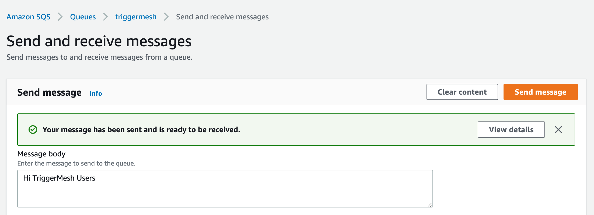
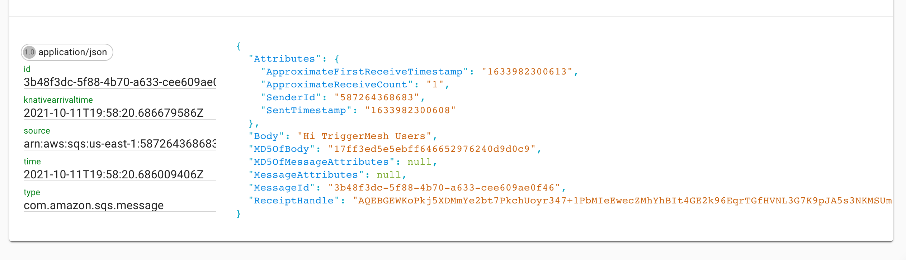

# Event Source for Amazon SQS

This event source captures events sent to an [Amazon SQS queue][sqs-docs].

The Amazon SQS event source emits events of the following type: `com.amazon.sqs.message`

## Initial setup

Prerequisites to using the SQS Source are:

- An SQS Queue
- The queue's ARN
- AWS API Credentials

### Create an SQS Queue

If you don't already have an Amazon SQS queue, create one by following the instructions in the [Getting started with
Amazon SQS][sqs-getting-started] guide.

### Obtain the queue's ARN

A fully qualified Amazon Resource Name (ARN) is required to uniquely identify the Amazon SQS queue.


As shown in the above screenshot, you can obtain the ARN of a SQS queue from the AWS console. It typically has the
following format:

```
arn:aws:sqs:{awsRegion}:{awsAccountId}:{queueName}
```

Alternatively you can also use the [AWS CLI][aws-cli]. The following command retrieves the ARN of a SQS queue named
`MyQueue` in the `us-west-2` region.

```console
$ aws --region us-west-2 sqs get-queue-attributes --queue-url $(aws --region us-west-2 sqs list-queues --queue-name MyQueue | jq -r .QueueUrls[0]) --attribute-names QueueArn
{
    "Attributes": {
        "QueueArn": "arn:aws:sqs:us-west-2:123456789012:MyQueue"
    }
}
```

### Obtain AWS API Credentials

The TriggerMesh event source for Amazon SQS can authenticate calls to the AWS API using AWS Access Keys. The page
[Understanding and getting your AWS credentials][accesskey] contains instructions to create access keys when signed-in
either as the root user or as an IAM user. Take note of the **Access Key ID** and **Secret Access Key**, they will be
used to create an instance of the event source.

It is considered a [good practice][iam-bestpractices] to create dedicated users with restricted privileges in order to
programmatically access AWS services. Permissions can be added or revoked granularly for a given IAM user by attaching
[IAM Policies][iam-policies] to it.

As an example, the following policy contains the permissions required by the TriggerMesh Amazon SQS event source to read
and delete messages from any queue linked to the AWS account:

```json
{
    "Version": "2012-10-17",
    "Statement": [
        {
            "Sid": "AWSSQSSourceReceiveAdapter",
            "Effect": "Allow",
            "Action": [
                "sqs:GetQueueUrl",
                "sqs:ReceiveMessage",
                "sqs:DeleteMessage"
            ],
            "Resource": [
                "arn:aws:sqs:*:*:*"
            ]
        }
    ]
}
```


## SQS Source with tmctl

```console
tmctl create source awssqs --arn <arn> --auth.credentials.accessKeyID=<access key> --auth.credentials.secretAccessKey=<secret key>
```
## SQS source on Kubernetes

### Using kubectl explain

You can explore the specification of the object using the `kubectl explain` command. You will see that you need the ARN (i.e Amazon Resource Name) of your AWS SQS queue and the AWS API keys that give you access to SQS.

```console
$ kubectl explain awssqssource.spec
KIND:     AWSSQSSource
VERSION:  sources.triggermesh.io/v1alpha1

RESOURCE: spec <Object>

DESCRIPTION:
     Desired state of the event source.

FIELDS:
   adapterOverrides     <Object>
     Kubernetes object parameters to apply on top of default adapter values.

   arn  <string> -required-
     ARN of the Amazon SQS queue to consume messages from. The expected format
     is documented at
     https://docs.aws.amazon.com/IAM/latest/UserGuide/list_amazonsqs.html#amazonsqs-resources-for-iam-policies.

   auth <Object>
     Authentication method to interact with the Amazon SQS API.

   endpoint     <Object>
     Customizations of the AWS REST API endpoint.

   messageProcessor     <string>
     Name of the message processor to use for converting SQS messages to
     CloudEvents. Supported values are "default" and "s3".

   receiveOptions       <Object>
     Options that control the behavior of message receivers.

   sink <Object> -required-
     The destination of events sourced from Amazon SQS.
```

### Creating a K8s secret

Create a secret called `awscreds` which contains your access key and your secret key like so:

```console
kubectl create secret generic awscreds \
  --from-literal=access_key_id=<ACCESS_KEY_ID> \
  --from-literal=secret_access_key=<SECRET_ACCESS_KEY>
```

!!! tip "AWS Credentials"
    Instructions about setting up AWS security credentials can be found in the [documentation page for the Amazon SQS source](https://docs.triggermesh.io/cloud/sources/awssqs/#api-credentials).

### Writing and applying a YAML manifest

Then, write a YAML manifest for your SQS source similar to the one below. The following sample points to a SQS queue, referenced by its ARN and a secret called `awscreds`.

```yaml
apiVersion: sources.triggermesh.io/v1alpha1
kind: AWSSQSSource
metadata:
  name: sqs-guide
spec:
  arn: arn:aws:sqs:us-east-1:123456789012:triggermesh
  receiveOptions:
    visibilityTimeout: 30m
  auth:
    credentials:
      accessKeyID:
        valueFromSecret:
          name: awscreds
          key: access_key_id
      secretAccessKey:
        valueFromSecret:
          name: awscreds
          key: secret_access_key
  sink:
    ref:
      apiVersion: eventing.knative.dev/v1
      kind: Broker
      name: default
```

Create this source with the `kubectl apply -f` command.

Verify that your source is ready with:

```console
$ kubectl get awssqssource
NAME          READY   REASON   SINK                                      AGE
sqs-guide     True             http://sockeye.sebgoa.svc.cluster.local   3m57s

```
### Test the flow

You can go to the AWS SQS console and put a message in the queue as shown in the following screenshot:



The message will get consumed by the source.

Below is a screenshot of an example event shown using the Sockeye event display service as a target.




[sqs-docs]: https://docs.aws.amazon.com/AWSSimpleQueueService/latest/SQSDeveloperGuide/welcome.html
[sqs-getting-started]: https://docs.aws.amazon.com/AWSSimpleQueueService/latest/SQSDeveloperGuide/sqs-getting-started.html
[aws-cli]: https://aws.amazon.com/cli/
[accesskey]: https://docs.aws.amazon.com/general/latest/gr/aws-sec-cred-types.html#access-keys-and-secret-access-keys
[iam-bestpractices]: https://docs.aws.amazon.com/general/latest/gr/aws-access-keys-best-practices.html#iam-user-access-keys
[iam-policies]: https://docs.aws.amazon.com/IAM/latest/UserGuide/access_policies.html
[arn]: https://docs.aws.amazon.com/IAM/latest/UserGuide/list_amazonsqs.html
[tm-secret]: ../secrets.md
