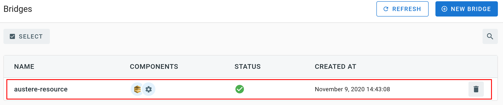

# Event Source for AWS SQS

The event source captures messages sent to a [AWS SQS queue][sqs-docs] and sends them as CloudEvents to an event sink.

## Prerequisite(s)

- SQS Queue
- Amazon Resource Name (ARN)
- API Credentials

### SQS Queue

If you don't already have an AWS SQS queue, create one by following the instructions in the [Getting started with Amazon
SQS][sqs-getting-started] guide.

### Amazon Resource Name (ARN)

A fully qualified ARN is required to uniquely identify the AWS SQS queue.


As shown in the above screenshot, you can obtain the ARN of a SQS queue from the AWS console. It typically has the
following format:

```
arn:aws:sqs:{awsRegion}:{awsAccountId}:{queueName}
```

Alternatively you can also use the [AWS CLI][aws-cli]. The following command retrieves the ARN of a SQS queue named
`MyQueue` in the `us-west-2` region.

```console
$ aws --region us-west-2 sqs get-queue-attributes --queue-url $(aws --region us-west-2 sqs list-queues --queue-name MyQueue | jq -r .QueueUrls[0]) --attribute-names QueueArn
{
    "Attributes": {
        "QueueArn": "arn:aws:sqs:us-west-2:123456789012:MyQueue"
    }
}
```

### API Credentials

The TriggerMesh event source for Amazon SQS authenticates calls to the AWS API using AWS Access Keys. The page
[Understanding and getting your AWS credentials][accesskey] contains instructions to create access keys when signed-in
either as the root user or as an IAM user. Take note of the **Access Key ID** and **Secret Access Key**, they will be
used to create an instance of the event source.

It is considered a [good practice][iam-bestpractices] to create dedicated users with restricted privileges in order to
programmatically access AWS services. Permissions can be added or revoked granularly for a given IAM user by attaching
[IAM Policies][iam-policies] to it.

As an example, the following policy contains the permissions required by the TriggerMesh AWS SQS event source to read
and delete messages from any queue linked to the AWS account:

```json
{
    "Version": "2012-10-17",
    "Statement": [
        {
            "Sid": "AWSSQSSourceReceiveAdapter",
            "Effect": "Allow",
            "Action": [
                "sqs:GetQueueUrl",
                "sqs:ReceiveMessage",
                "sqs:DeleteMessage",
                "sqs:DeleteMessageBatch"
            ],
            "Resource": [
                "arn:aws:sqs:*:*:*"
            ]
        }
    ]
}
```


## Deploying an Instance of the Source

Open the Bridge creation screen and add a source of type `AWS SQS`.


In the Source creation form, give a name to the event source and add the following information:

- [**Secret**][accesskey]: Reference to a [TriggerMesh secret][tm-secret] containing an Access Key ID and a Secret
  Access Key to communicate with the AWS SQS API, as described in the previous sections.
- [**AWS ARN**][arn]: ARN of the SQS queue, as described in the previous sections.


After clicking the `Save` button, you will be taken back to the Bridge editor. Proceed to adding the remaining
components to the Bridge, then submit it.


A ready status on the main _Bridges_ page indicates that the event source is ready to receive notifications from the AWS
SQS queue.



## Event Types

The AWS SQS event source emits events of the following type:

- `com.amazon.sqs.message`

[sqs-docs]: https://docs.aws.amazon.com/AWSSimpleQueueService/latest/SQSDeveloperGuide/welcome.html
[sqs-getting-started]: https://docs.aws.amazon.com/AWSSimpleQueueService/latest/SQSDeveloperGuide/sqs-getting-started.html
[aws-cli]: https://aws.amazon.com/cli/
[accesskey]: https://docs.aws.amazon.com/general/latest/gr/aws-sec-cred-types.html#access-keys-and-secret-access-keys
[iam-bestpractices]: https://docs.aws.amazon.com/general/latest/gr/aws-access-keys-best-practices.html#iam-user-access-keys
[iam-policies]: https://docs.aws.amazon.com/IAM/latest/UserGuide/access_policies.html
[arn]: https://docs.aws.amazon.com/IAM/latest/UserGuide/list_amazonsqs.html
[tm-secret]: ../guides/secrets.md
