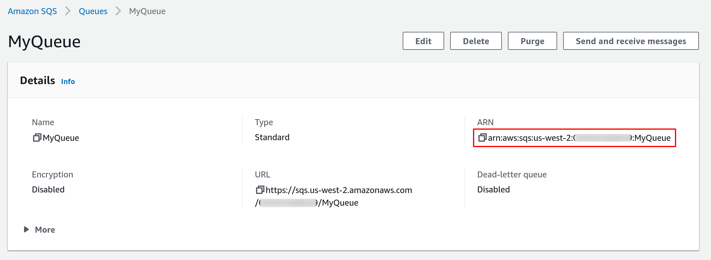

# Amazon SQS source

Consumes events from an [Amazon SQS queue][sqs-docs].

With `tmctl`:

```
tmctl create source awssqs --arn <arn> --auth.credentials.accessKeyID <access key> --auth.credentials.secretAccessKey <secret key>
```

On Kubernetes:

```yaml
apiVersion: sources.triggermesh.io/v1alpha1
kind: AWSSQSSource
metadata:
  name: sqs-guide
spec:
  arn: arn:aws:sqs:us-east-1:123456789012:triggermesh
  receiveOptions:
    visibilityTimeout: 30m
  auth:
    credentials:
      accessKeyID:
        valueFromSecret:
          name: awscreds
          key: access_key_id
      secretAccessKey:
        valueFromSecret:
          name: awscreds
          key: secret_access_key
  sink:
    ref:
      apiVersion: eventing.triggermesh.io/v1alpha1
      kind: RedisBroker
      name: triggermesh
```

Alternatively you can use an IAM role for authentication instead of an access key and secret, for Amazon EKS only:

```yaml
auth:
  iamrole: arn:aws:iam::123456789012:role/foo
```

For details on authenticating with AWS, please take a look at our [dedicated guide on AWS credentials](../guides/credentials/awscredentials.md).

Events produced have the following attributes:

* type `com.amazon.sqs.message`
* source `<arn>`
* Schema of the `data` attribute: [com.amazon.sqs.message.json](https://raw.githubusercontent.com/triggermesh/triggermesh/main/schemas/com.amazon.sqs.message.json)

See the [Kubernetes object reference](../../reference/sources/#sources.triggermesh.io/v1alpha1.AWSSQSSource) for more details.

## Prerequisites

- An SQS Queue
- The queue's ARN

### Create an SQS Queue

If you don't already have an Amazon SQS queue, create one by following the instructions in the [Getting started with
Amazon SQS][sqs-getting-started] guide.

### Obtain the queue's ARN

A fully qualified Amazon Resource Name (ARN) is required to uniquely identify the Amazon SQS queue.



As shown in the above screenshot, you can obtain the ARN of a SQS queue from the AWS console. It typically has the
following format:

```
arn:aws:sqs:{awsRegion}:{awsAccountId}:{queueName}
```

Alternatively you can also use the [AWS CLI][aws-cli]. The following command retrieves the ARN of a SQS queue named
`MyQueue` in the `us-west-2` region.

```console
$ aws --region us-west-2 sqs get-queue-attributes --queue-url $(aws --region us-west-2 sqs list-queues --queue-name MyQueue | jq -r .QueueUrls[0]) --attribute-names QueueArn
{
    "Attributes": {
        "QueueArn": "arn:aws:sqs:us-west-2:123456789012:MyQueue"
    }
}
```

## Guide to SQS source on Kubernetes

### Creating a K8s secret

Create a secret called `awscreds` which contains your access key and your secret key like so:

```console
kubectl create secret generic awscreds \
  --from-literal=access_key_id=<ACCESS_KEY_ID> \
  --from-literal=secret_access_key=<SECRET_ACCESS_KEY>
```

### Writing and applying a YAML manifest

Then, write a YAML manifest for your SQS source similar to the one below. The following sample points to a SQS queue, referenced by its ARN and a secret called `awscreds`.

```yaml
apiVersion: sources.triggermesh.io/v1alpha1
kind: AWSSQSSource
metadata:
  name: sqs-guide
spec:
  arn: arn:aws:sqs:us-east-1:123456789012:triggermesh
  receiveOptions:
    visibilityTimeout: 30m
  auth:
    credentials:
      accessKeyID:
        valueFromSecret:
          name: awscreds
          key: access_key_id
      secretAccessKey:
        valueFromSecret:
          name: awscreds
          key: secret_access_key
  sink:
    ref:
      apiVersion: eventing.knative.dev/v1
      kind: Broker
      name: default
```

Create this source with the `kubectl apply -f` command.

Verify that your source is ready with:

```console
$ kubectl get awssqssource
NAME          READY   REASON   SINK                                      AGE
sqs-guide     True             http://sockeye.sebgoa.svc.cluster.local   3m57s

```
### Test the flow

You can go to the AWS SQS console and put a message in the queue as shown in the following screenshot:


The message will get consumed by the source.

Below is a screenshot of an example event shown using the Sockeye event display service as a target.


[sqs-docs]: https://docs.aws.amazon.com/AWSSimpleQueueService/latest/SQSDeveloperGuide/welcome.html
[sqs-getting-started]: https://docs.aws.amazon.com/AWSSimpleQueueService/latest/SQSDeveloperGuide/sqs-getting-started.html
[aws-cli]: https://aws.amazon.com/cli/
[accesskey]: https://docs.aws.amazon.com/general/latest/gr/aws-sec-cred-types.html#access-keys-and-secret-access-keys
[iam-bestpractices]: https://docs.aws.amazon.com/general/latest/gr/aws-access-keys-best-practices.html#iam-user-access-keys
[iam-policies]: https://docs.aws.amazon.com/IAM/latest/UserGuide/access_policies.html
[arn]: https://docs.aws.amazon.com/IAM/latest/UserGuide/list_amazonsqs.html
[tm-secret]: ../secrets.md
