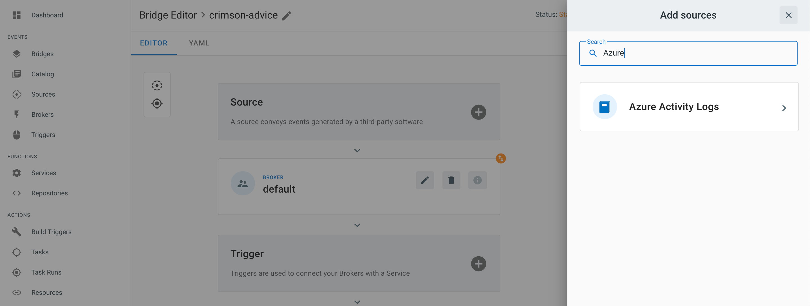

# Event source for Azure Activity Logs

This event source forwards [Activity Logs][activity-logs] from a given Azure Subscription by routing them over [Azure
Event Hubs][eventhubs]. It does so by registering [Diagnostic Settings][diag-settings] that automatically send a
selected set of log categories to a dedicated Event Hub, then subscribing to the events from that Event Hub.

## Prerequisites

### Service principal

A [Service Principal][sp] is required in order to authenticate the event source against the Azure tenant that has
authority over the Azure Subscription to monitor. You can create a Service Principal by following the instructions at
[How to: Use the portal to create an Azure AD application and service principal that can access resources][sp-create].

The section called _Assign a role to the application_ describes how to assign permissions to the Service Principal. Make
sure you select a role which has at least the following permissions:

- `Microsoft.Insights/DiagnosticSettings/Read`
- `Microsoft.Insights/DiagnosticSettings/Delete`
- `Microsoft.Insights/DiagnosticSettings/Write`
- `Microsoft.EventHub/namespaces/authorizationRules/listkeys/action`

Additionally, assign the role `Azure Event Hubs Data Receiver` to the Service Principal to allow it to receive events
from Event Hubs.

In the example below, we create a custom IAM role that is dedicated to the TriggerMesh Activity Logs event source:


The corresponding role JSON is given as a reference which you can replicate to create a similar custom IAM role:

```json
{
    "properties": {
        "roleName": "TriggerMesh Activity logs manager",
        "description": "Allows the usage of TriggerMesh event sources for Azure Activity Logs.",
        "assignableScopes": [
            "/subscriptions/d2f958de-93b1-4c73-9ce0-b7e1dc43c4ba"
        ],
        "permissions": [
            {
                "actions": [
                    "Microsoft.Insights/DiagnosticSettings/Read",
                    "Microsoft.Insights/DiagnosticSettings/Delete",
                    "Microsoft.Insights/DiagnosticSettings/Write",
                    "Microsoft.EventHub/namespaces/authorizationRules/listkeys/action"
                ],
                "notActions": [],
                "dataActions": [],
                "notDataActions": []
            }
        ]
    }
}
```

After the Service Principal is created and assigned suitable roles, take note of the following three informations:

* **Tenant ID** and **Client ID** (see _Get values for signing in_)
* **Client secret** (see _Certificates and secrets > Create a new application secret_)

### Event Hubs namespace

Follow the instructions at [Quickstart: Create an event hub using Azure portal][eventhubs-create] and create a new Event
Hubs Namespace that will be used to send the Subscription's Activity Logs. Only the namespace needs to be created, the
event source creates Diagnostic Settings which in turn create their own Event Hub for sending Activity Logs.


### Shared access policy / shared access signature (SAS)

The TriggerMesh Activity Logs event source requires a reference to a Shared Access Policy (also called [Shared Access
Signatures][sas]) in the form of a resource ID. This policy contains a token that can be used to delegate permissions
within an Event Hubs namespace, such as the management of Event Hub instances.

Open your Event Hubs namespace, then open the _Shared access policies_ panel under the _Settings_ section of the Event
Hubs screen. By default, the namespace contains a pre-created policy called `RootManageSharedAccessKey` with `Manage,
Send, Listen` claims, which is perfectly suitable for the TriggerMesh Activity Logs event source. If you prefer to use
your own policy instead, make sure it has the same `Manage, Send, Listen` claims as the default policy.


The easiest way to obtain the resource ID of a Shared Access Policy is by using the [Azure CLI][azure-cli] (`az`). The
following command line uses values from the screenshots above:

```console
$ az eventhubs namespace authorization-rule list --resource-group TriggerMesh --namespace triggermesh-event-sources
[
  {
    "id": "/subscriptions/d2f958de-93b1-4c73-9ce0-b7e1dc43c4ba/resourceGroups/TriggerMesh/providers/Microsoft.EventHub/namespaces/triggermesh-event-sources/AuthorizationRules/RootManageSharedAccessKey",
    "location": "West Europe",
    "name": "RootManageSharedAccessKey",
    "resourceGroup": "TriggerMesh",
    "rights": [
      "Listen",
      "Manage",
      "Send"
    ],
    "type": "Microsoft.EventHub/Namespaces/AuthorizationRules"
  }
]
```

If you don't have the Azure CLI installed on your workstation, you can use the template below to compose a fully
qualified resource ID of a Shared Access Policy. `{authorizationRuleName}` is to be replaced with the name of the policy
as shown in the Azure Portal.

```
/subscriptions/{subscriptionId}/resourceGroups/{resourceGroupName}/providers/Microsoft.EventHub/namespaces/{namespaceName}/authorizationRules/{authorizationRuleName}
```

## Deploying an instance of the Source

Open the Bridge creation screen and add a source of type `Azure Activity Logs`.



In the Source creation form, give a name to the event source and add the following information:

* [SAS Policy ID][sas-policy]: Resource ID of a SAS policy with Manage permissions on an Event Hubs namespace, as
  described in the previous sections. Besides the SAS policy name itself, the resource ID contains the subscription ID,
  resource group name and Event Hubs namespace to be used by the event source.
* [Log categories][log-categories]: _(optional)_ Categories of Activity Logs to collect. All available categories are
  selected when the list of categories is left empty.
* [Event Hub name][eventhubs-create]: _(optional)_ Name of an Event Hub to send data to. When the Event Hub name is
  set, an Event Hub with the given name MUST already exist within the namespace. When it is not set, Azure creates an
  Event Hub with the name `insights-activity-logs` upon reception of the first log entry.
* [Tenant ID, Client ID, Client secret][sp-create]: Service Principal authentication credentials, as described in the
  previous sections.


After clicking the `Save` button, you will be taken back to the Bridge editor. Proceed to adding the remaining
components to the Bridge, then submit it.


A ready status on the main _Bridges_ page indicates that the [Diagnostic Settings][diag-settings] were successfully
created and that the event source is ready to route events from Event Hubs.


After creating a Bridge with the Azure Activity Logs event source, navigate back to the Event Hubs screen in the Azure
Portal. You should see a message count above 0 within the namespace, providing that activity logs are being generated
within the Azure Subscription.


## Event types

The Azure Activity Logs event source emits events of the following type:

* `com.microsoft.azure.monitor.activity-log`

[activity-logs]: https://docs.microsoft.com/en-us/azure/azure-monitor/platform/activity-log
[diag-settings]: https://docs.microsoft.com/en-us/azure/azure-monitor/platform/diagnostic-settings

[sp]: https://docs.microsoft.com/en-us/azure/active-directory/develop/app-objects-and-service-principals
[sp-create]: https://docs.microsoft.com/en-us/azure/active-directory/develop/howto-create-service-principal-portal

[eventhubs]: https://docs.microsoft.com/en-us/azure/event-hubs/
[eventhubs-create]: https://docs.microsoft.com/en-us/azure/event-hubs/event-hubs-create

[azure-cli]: https://docs.microsoft.com/en-us/cli/azure
[sas]: https://docs.microsoft.com/en-us/azure/storage/common/storage-sas-overview

[sas-policy]: https://docs.microsoft.com/en-us/azure/event-hubs/authorize-access-shared-access-signature
[log-categories]: https://docs.microsoft.com/en-us/azure/azure-monitor/platform/activity-log-schema#categories
