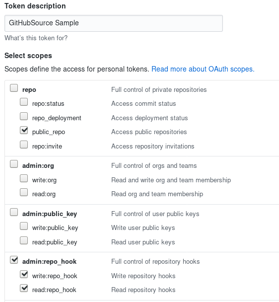

# Event Source for Github

This event source creates a webhook to listen for incoming Github Events, turning received requests into [CloudEvents][ce] to be consumed by other TriggerMesh components.

## Prerequisite(s)

- GitHub Tokens

### Create GitHub Tokens
Create a personal access token for GitHub that the GitHub source can use to register webhooks with the GitHub API. Also decide on a secret token that your code will use to authenticate the incoming webhooks from GitHub (secretToken).

The token can be named anything you find convenient. The Source requires `repo:public_repo` and `admin:repo_hook`, to let it fire events from your public repositories and to create webhooks for those repositories. Copy and save this token; GitHub will force you to generate it again if misplaced.

Here's an example for a token named "GitHubSource Sample" with the recommended scopes:

## Deploying an Instance of the Source

Open the Bridge creation screen and add a source of type `Github`.

In the Source creation form, give a name to the event source and add the following information:

- **Secret**: Reference to a [TriggerMesh secret][tm-secret] containing an Access Token and Secret Token, as described in the previous sections.
- **Name**: all TriggerMesh components need a unique name per namespace.
- **Broker**: request converted into [CloudEvents][ce] will be sent to this location.
- **Repository owner and Name**: A valid GitHub public repository owned by your GitHub user. (eg. <YOUR USER>/<YOUR REPO>).
- **Event Types**: Select from the dropdown the types of events the source should emit. 

After clicking the `Save` button, you will be taken back to the Bridge editor. Proceed by adding the remaining components to the Bridge, then submit it.

A ready status on the main _Bridges_ page indicates that the event source is ready to receive notifications from the Github Event Source.

### Verify

Verify the GitHub webhook was created by looking at the list of webhooks under the Settings tab in your GitHub repository. A hook should be listed that points to your Knative cluster with a green check mark to the left of the hook URL, as shown below.

### More Information 
More information on the Github Event Source can be found here: https://knative.dev/docs/eventing/samples/github-source/

## Event Types

The Github event source emits events that begin with `dev.knative.source.github.` and end in the event type. For example: `dev.knative.source.github.pull_request`, `dev.knative.source.github.create`, and `dev.knative.source.github.delete`.

[tm-secret]: ../guides/secrets.md
[ce]: https://cloudevents.io