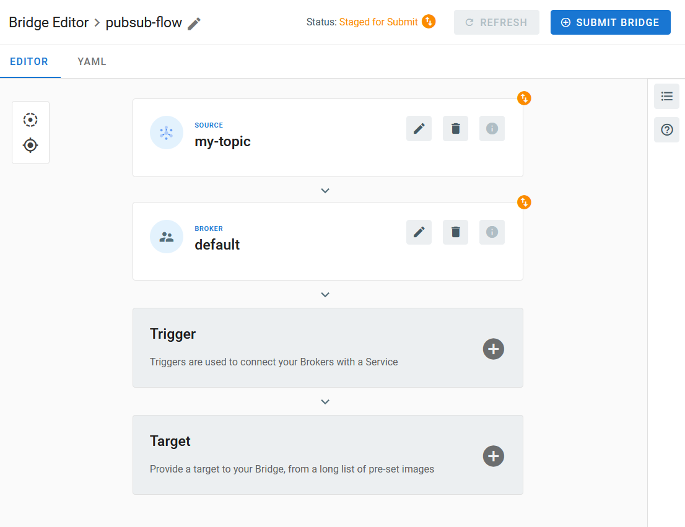

# Event Source for Google Cloud Pub/Sub

This event source subscribes to messages sent to a [Google Cloud Pub/Sub][gc-pubsub] topic.

## Prerequisites

### Service Account

A [Service Account][gc-pubsub-svcacc] is required to authenticate the event source and allow it to interact with Google
Cloud Pub/Sub. You can create a service account by following the instructions at [Creating and managing service
accounts][gc-iam-svcacc].

The service account must be granted an [IAM Role][gc-iam-roles] with at least the following permissions:

- `pubsub.subscriptions.consume`
- `pubsub.subscriptions.get`

The following set of permissions is also required if you delegate the management of the Pub/Sub subscription to the
event source. In case you prefer to manage the subscription yourself, these can be safely be omitted. More details on
that topic are provided in the [Pub/Sub Subscription](#pubsub-subscription-optional) section below.

- `pubsub.subscriptions.create`
- `pubsub.subscriptions.delete`

The predefined `roles/pubsub.editor` role is one example of role that is suitable for use with the TriggerMesh event
source for Google Cloud Pub/Sub.

<!-- NOTE(antoineco): image from googlecloudstorage source purposely reused for simplicity -->

Create a [key][gc-iam-key] for this service account and save it. This key must be in JSON format. It is required to be
able to run an instance of the Google Cloud Pub/Sub event source.

### Pub/Sub Topic

If you don't already have a Pub/Sub topic to subscribe to, create one by following the instructions at [Managing topics
and subscriptions][gc-pubsub-adm].

Take note of the full [topic name][gc-pubsub-resname], it is a required input to be able to run an instance of the
Google Cloud Pub/Sub event source.

<!-- NOTE(antoineco): image from googlecloudstorage source purposely reused for simplicity -->

### Pub/Sub Subscription _(optional)_

A subscription is required in order to allow the TriggerMesh event source for Google Cloud Pub/Sub to pull messages
from a Pub/Sub topic.

This section can be skipped if you would like to let the event source manage its own subscription, which is the default
behaviour. In this case, please simply ensure you granted all necessary permissions to the service account in the
previous section.

If, however, you prefer messages to be pulled using a subscription which you manage yourself, please ensure that
subscription is a "pull" subscription as described in the documentation page [Managing topics and
subscriptions][gc-pubsub-adm].

<!-- NOTE(antoineco): image from googlecloudstorage source purposely reused for simplicity -->

## Deploying an Instance of the Source

Open the Bridge creation screen and add a source of type `Google Cloud Pub/Sub`.

In the Source creation form, give a name to the event source and add the following information:

* [**Secret**][gc-iam-key]: Service account key in JSON format, as described in the previous sections.
* [**Topic**][gc-pubsub-resname]: Full resource name of the Pub/Sub topic to subscribe to.
* **Subscription ID**: _(optional)_ ID of the subscription to use for pulling messages from the Pub/Sub topic, in case
  you prefer to manage this subscription yourself as described in the previous sections.

After clicking the `Save` button, you will be taken back to the Bridge editor. Proceed to adding the remaining
components to the Bridge, then submit it.

A ready status on the main _Bridges_ page indicates that the event source is ready to consume messages from the Pub/Sub
topic.

## Event Types

The TriggerMesh event source for Google Cloud Pub/Sub emits events of the following type:

* `com.google.cloud.pubsub.message`

[gc-pubsub]: https://cloud.google.com/pubsub
[gc-pubsub-svcacc]: https://cloud.google.com/pubsub/docs/authentication#service-accounts
[gc-pubsub-adm]: https://cloud.google.com/pubsub/docs/admin
[gc-pubsub-resname]: https://cloud.google.com/pubsub/docs/admin#resource_names
[gc-iam-svcacc]: https://cloud.google.com/iam/docs/creating-managing-service-accounts
[gc-iam-key]: https://cloud.google.com/iam/docs/creating-managing-service-account-keys
[gc-iam-roles]: https://cloud.google.com/iam/docs/understanding-roles
