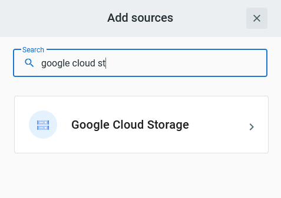
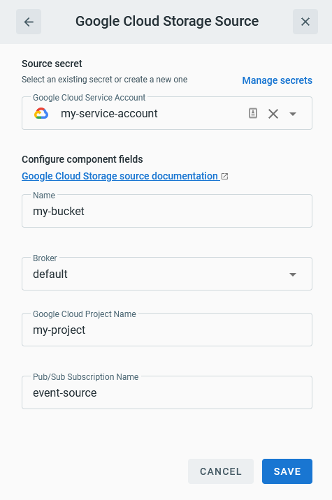
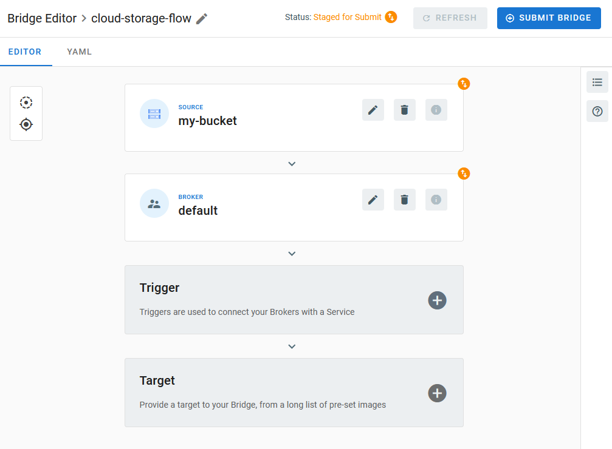
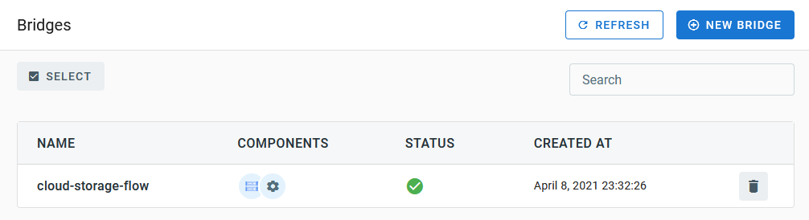

# Event Source for Google Cloud Storage

This event source receives change notifications emerging from a [Google Cloud Storage][gc-storage] bucket by subscribing
to a [Google Cloud Pub/Sub][gc-storage-events] topic.

## Prerequisite(s)

* Storage Bucket
* Pub/Sub Topic and Subscription
* Notification Configuration
* Service Account

### Storage Bucket

The storage bucket is expected to exist prior to running this event source. If you haven't already done so, create a
bucket by following the instructions from the [Cloud Storage How-To Guides][gc-storage-howto].

### Pub/Sub Topic and Subscription

A Pub/Sub topic is required to be able to consume change notifications from Cloud Storage.

You can either create this topic manually by following the instructions at [Managing topics and
subscriptions][gc-pubsub-adm], or instead use the [`gsutil`][gsutil] command-line tool to create the Pub/Sub topic and
add a notification configuration to the bucket in a single step, as described at [Using Pub/Sub notifications for Cloud
Storage][gc-storage-setup].


Once a topic exists, it is necessary to create a _subscription_ in order to allow the TriggerMesh event source for
Google Cloud Storage to pull events from this topic. The documentation page [Managing topics and
subscriptions][gc-pubsub-adm] explains this procedure in details.

Take note of the name of this subscription, it is a required input to be able to run an instance of the Google Cloud
Storage event source.


### Notification Configuration

Change notifications need to be enabled in the selected bucket by applying a _notification configuration_.

If you have already followed the instructions from the previous section and applied a notification configuration at the
same time as you created the Pub/Sub topic using `gsutil`, your bucket is already configured for sending events.
Otherwise, follow the instructions at [Using Pub/Sub notifications for Cloud Storage][gc-storage-setup] and add a new
notification configuration.

Below is an example of command which applies a notification configuration to a bucket called `eventsource-dev`, with a
Pub/Sub topic called `triggermesh-storage-source` set as event destination.

```console
$ gsutil notification create -t triggermesh-storage-source -f json gs://eventsource-dev
Created Cloud Pub/Sub topic projects/my-project/topics/triggermesh-storage-source
Created notification config projects/_/buckets/eventsource-dev/notificationConfigs/1
```

```console
$ gsutil notification list gs://eventsource-dev
projects/_/buckets/eventsource-dev/notificationConfigs/1
        Cloud Pub/Sub topic: projects/my-project/topics/triggermesh-storage-source
```

!!! note
    It is currently not possible to manage Pub/Sub notifications via the Cloud Console.

### Service Account

A [Service Account][gc-storage-svcacc] is required to authenticate the event source and allow it to interact with Google
Cloud Pub/Sub. You can create a service account by following the instructions at [Creating and managing service
accounts][gc-iam-svcacc].

The service account must be granted an [IAM Role][gc-iam-roles] with at least the following permission:

* `pubsub.subscriptions.consume`

The predefined `roles/pubsub.subscriber` role is one example of role that is suitable for use with the TriggerMesh event
source for Google Cloud Storage.


Create a [key][gc-iam-key] for this service account and save it. This key must be in JSON format. It is required to be
able to run an instance of the Google Cloud Storage event source.

## Deploying an Instance of the Source

Open the Bridge creation screen and add a source of type `Google Cloud Storage`.



In the Source creation form, give a name to the event source and add the following information:

* [**Secret**][gc-iam-key]: Service account key in JSON format, as described in the previous sections.
* **Google Cloud project name**: Name of the Google Cloud project containing the storage bucket.
* **Pub/Sub Subscription name**: Name of a Pub/Sub subscription which pulls messages from the topic where the Cloud
  Storage bucket sends its change notifications.



After clicking the `Save` button, you will be taken back to the Bridge editor. Proceed to adding the remaining
components to the Bridge, then submit it.



A ready status on the main _Bridges_ page indicates that the event source is ready to consume Cloud Storage
notifications from the Pub/Sub topic.



## Event Types

The TriggerMesh event source for Google Cloud Storage emits events of the following type:

* `com.triggermesh.googlecloudstorage.event`

[gc-storage]: https://cloud.google.com/storage/docs/introduction
[gc-storage-events]: https://cloud.google.com/storage/docs/pubsub-notifications
[gc-storage-howto]: https://cloud.google.com/storage/docs/how-to
[gc-storage-svcacc]: https://cloud.google.com/storage/docs/projects#service-accounts
[gc-storage-setup]: https://cloud.google.com/storage/docs/reporting-changes
[gc-iam-svcacc]: https://cloud.google.com/iam/docs/creating-managing-service-accounts
[gc-iam-key]: https://cloud.google.com/iam/docs/creating-managing-service-account-keys
[gc-iam-roles]: https://cloud.google.com/iam/docs/understanding-roles
[gc-pubsub-adm]: https://cloud.google.com/pubsub/docs/admin
[gsutil]: https://cloud.google.com/storage/docs/gsutil
