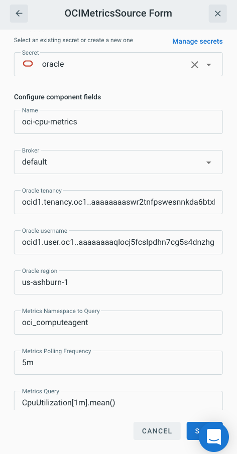

# Event Source for Oracle Cloud Infrastructure Metrics (OCIMetrics)

This event source collects metrics data from the [Oracle Cloud](https://cloud.oracle.com).

## Prerequisite(s)

<<<<<<< HEAD
* Oracle Cloud Account
* Oracle Cloud Infrastructure (OCI)
* Oracle Cloud Secret
=======
- Oracle Cloud Account
- Oracle Cloud Infrastructure (OCI)
- Oracle Cloud Secret
>>>>>>> Update Sources to look like the template formatting #126

### Oracle Cloud Account

An Oracle Cloud account is required.

### Oracle Cloud Infrastructure (OCI)

The Oracle Cloud account needs to have permissions to inspect and read metrics for the Oracle Cloud Infrastructure (OCI) compartment.

For additional information on how to create an API key and associate it with
your Oracle Cloud user, go to [Oracle's Developer Documentation](https://docs.cloud.oracle.com/en-us/iaas/Content/API/Concepts/apisigningkey.htm#Required_Keys_and_OCID)

### Oracle Cloud Secret

Three pieces of information are required for the Oracle Cloud:
1. API Private Key used for signing the request
2. API Private Key passphrase to decrypt the key
3. API Key's fingerprint to identify which key to use on the Oracle Cloud end

Consult the [Secrets](../guides/secrets.md) guide for more information about
how to add an Oracle Cloud specific secret.

## Deploying an Instance of the Source

### Creating the Source

Open the Bridge creation screen and add a source of type `OCIMetrics`.

In the source creation form, provide a unique name and broker. These are used by
Triggermesh to uniquely identify the source and where to send the events to.

For the Oracle Cloud specific information, provide the following information:
* Oracle tenancy using the Oracle Cloud ID (OCID)
* Oracle username as an OCID
* Oracle Cloud region where the metrics should be pulled from

For the metrics specific information:
* Metrics namespace such as `oci_computeagent` or `oci_vcn`
* The metrics query based on [MQL](https://docs.cloud.oracle.com/en-us/iaas/Content/Monitoring/Reference/mql.htm)

For details on how to write a query, consult the
[Oracle Cloud Monitoring Overview](https://docs.cloud.oracle.com/en-us/iaas/Content/Monitoring/Concepts/monitoringoverview.htm)

After clicking the `SAVE` button, you will be taken back to the Bridge editor.
Continue to add the targets, and then submit the bridge.

## Event Types

The CloudEvent type is:

    com.oracle.cloud.monitoring

The CloudEvent source of the form:

    ocimetrics/<namespace>/<source-name>

Where `namespace` is your current namespace and `source-name` is the name
specified during creation of the source.

The event payload will match the payload from the [Oracle Cloud Monitoring API's
Metric Data](https://docs.cloud.oracle.com/en-us/iaas/api/#/en/monitoring/20180401/MetricData/).
