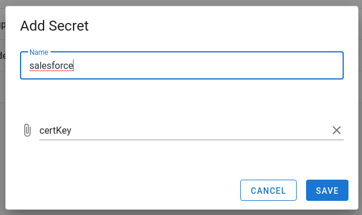
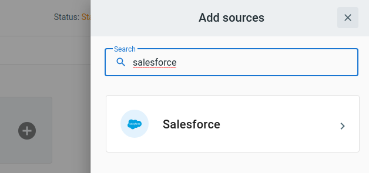
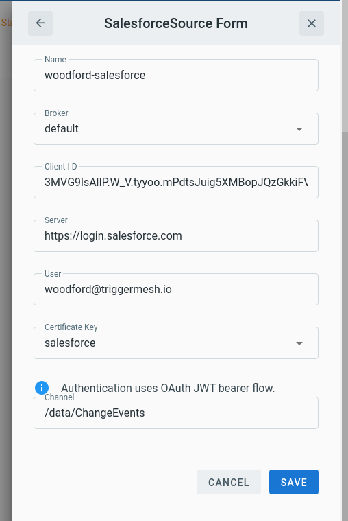

# Event Source for Salesforce

This event source acts as a consumer of the [Salesforce stream API][salesforce-stream-api-docs] and forwards all messages it receives
after wrapping them in a [CloudEvent][ce] envelope.

## Prerequisite(s)

- Salesforce Account
- Salesforce Stream Channel
- Certificate Key Secret

### Salesforce Account

Salesforce source uses [OAuth JWT credentials][salesforce-oauth-jwt] for service authentication.

1. First, you will need to generate an X509 certificate for signing and verifying requests.
We will be using `OpenSSL` but any other certificate generation tool should work.

    ```sh
    openssl req -x509 -sha256 -nodes -days 36500 -newkey rsa:2048 -keyout tm-sf.key -out tm-sf.crt
    ```

2. At Salesforce site select `Setup > Apps > App Manager`, click on `New Connected App`.

    - Fill in mandatory fields, then click `Enable OAuth Settings`.
    - A callback URL is mandatory but can be filled with any HTTPS data.
    - Enable `Use digital signatures` and upload the public cert (`tm-sf.crt` in the example above).
    - Add Scopes for `api` and `refresh_token, offline_access`.
    - Save.

    

    - Select the Connected App from the list and at the click on `Manage`.
    - Click `Edit policies`.
    - Set Permitted users to `Admin approved users are pre-authorized`.
    - Save.

    

    - Select the Connected App from the list and at the click on `Manage`.
    - Click `Manage Profiles`.
    - Add permissions on the data this user will have access to.
    - Save.

3. Retrieve OAuth data to configure Triggermesh Source.

   - Select the Connected App from the list and at the click on `View`.
   - Copy `Consumer Key`
   - Reveal and copy `Consumer Secret`

### Salesforce Stream Channel

Refer to [Salesforce stream API][salesforce-stream-api-docs] on how to create stream channels:

- Change Data Capture events: `/data/ChangeEvents`
- PushTopics for streams based on single entity SOQL queries: `/topic/TicketsSold`
- Standard Platform Events for Salesforce event monitoring: `/event/LoginEventStream`
- Custom Platform Events for your SOQL platform events: `/event/MyCustom__e`

Each Streaming event type has a distinct [set of features][salesroce-event-features]

### Certificate Key Secret

The TriggerMesh Salesforce integration needs the certificate key to sign authentication requests with the Salesforce API.
A [secret needs to be created at Triggermesh][tm-secret] that contains that certificate key.
The file name containing the key will need to be renamed to `certKey`, then select `Secrets` > `+ ADD SECRET`, `File Upload`



## Deploying an Instance of the Source

Open the Bridge creation screen and add a source of type `Salesforce`.



In the Source creation form, give a name to the event source and add the following information:

- **Broker** to send the events to.
- **Client ID** as retrieved from Salesforce Connected App.
- **Server** for authentication at Salesforce.
- **User** for the Salesforce account.
- **Channel** as configured at the Salesforce stream.



After clicking `Save` at the source, you will be taken back to the Bridge editor. Proceed to add the remaining components to the Bridge, then submit it.

Wait a few seconds for all components to become ready, the green `Status` indicator for the bridge indicates that the event source is ready to forward messages from the Salesforce event Stream.


## Event Types

The Salesforce event source emits events of the following types:

- `com.salesforce.stream.message`

[salesforce-stream-api-docs]: https://developer.salesforce.com/docs/atlas.en-us.api_streaming.meta/api_streaming/
[salesforce-oauth-jwt]: https://help.salesforce.com/articleView?id=remoteaccess_oauth_jwt_flow.htm
[salesroce-event-features]: https://developer.salesforce.com/docs/atlas.en-us.api_streaming.meta/api_streaming/event_comparison.htm
[ce]: https://cloudevents.io/

[tm-secret]: ../guides/secrets.md
