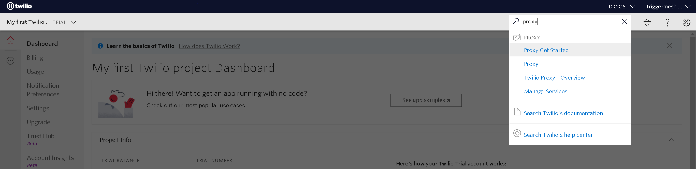
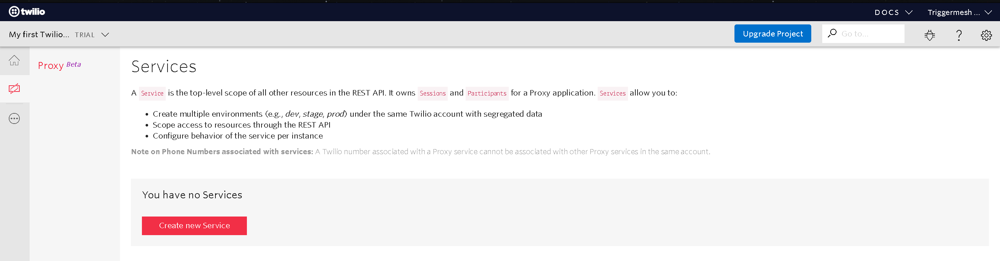
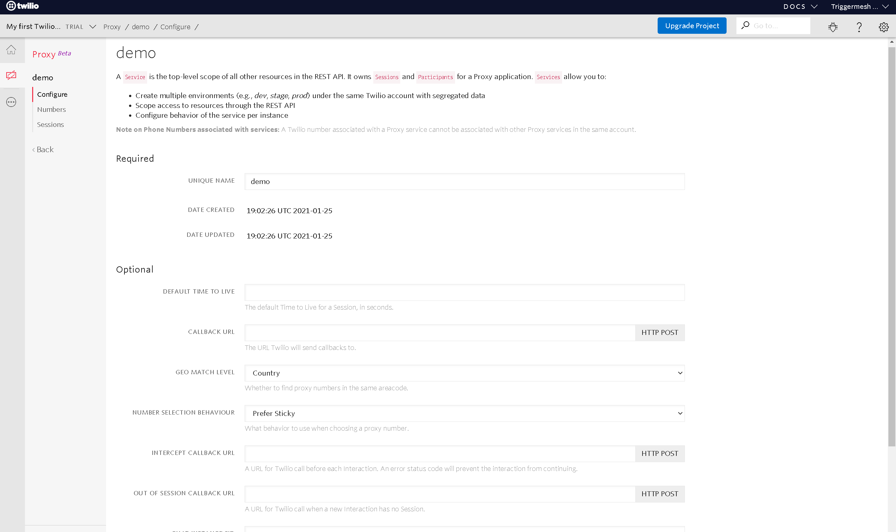
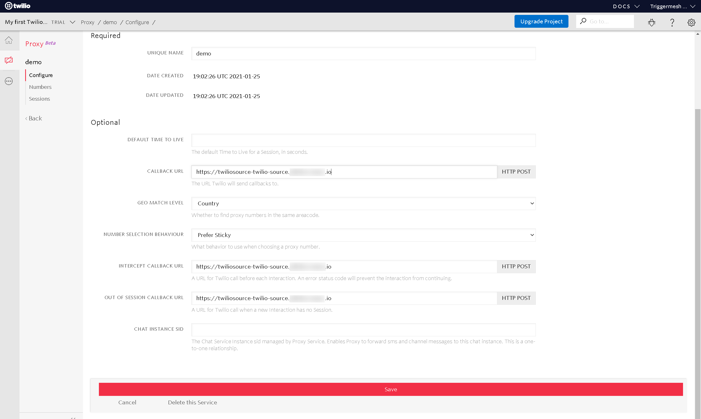
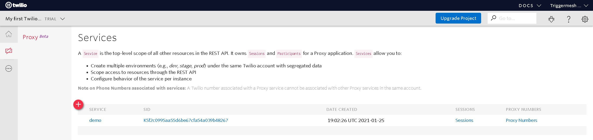
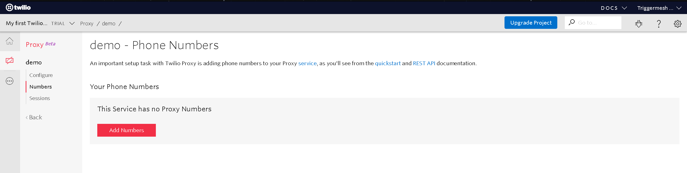
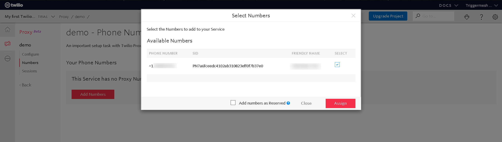

# Twilio source

This event source is to be deployed and then registered as a webhook via a Twilio [Proxy][proxy].

With `tmctl`:

```
tmctl create source twilio
```

On Kubernetes:

```yaml
apiVersion: sources.triggermesh.io/v1alpha1
kind: TwilioSource
metadata:
  name: sample
spec:
  sink:
    ref:
      apiVersion: eventing.triggermesh.io/v1alpha1
      kind: RedisBroker
      name: triggermesh
```

Events produced have the following attributes:

* type `com.triggermesh.twilio.sms`
* Schema of the `data` attribute: [com.triggermesh.twilio.sms.json](https://raw.githubusercontent.com/triggermesh/triggermesh/main/schemas/com.triggermesh.twilio.sms.json)

Example event emitted from this source:

```
☁️  cloudevents.Event
Validation: valid
Context Attributes,
  specversion: 1.0
  type: com.triggermesh.twilio.sms
  source: io.triggermesh.twilio/jeff/twilio-source
  id: 6a547451-be05-4da4-a10f-1af92422c7d1
  time: 2021-01-25T19:18:38.550812939Z
  datacontenttype: application/json
Extensions,
  knativearrivaltime: 2021-01-25T19:18:38.580569695Z
Data,
  {
    "message_sid": "ASDFc9ac2663bbeASDFd51a",
    "sms_status": "received",
    "from_country": "US",
    "num_segments": "1",
    "to_zip": "99204",
    "num_meda": "",
    "account_sid": "ADF0610bd2e60abdda72",
    "sms_message_sid": "ASKDFb2c9ac26621CADfca1d51a",
    "api_version": "2010-04-01",
    "to_country": "US",
    "to_city": "SPOKANE",
    "from_zip": "27707",
    "sms_sid": "ASDFc2663bbefcASa",
    "from_state": "NC",
    "body": "hello world",
    "from": "<redacted>",
    "from_city": "DURHAM",
    "to": "<redacted>",
    "to_state": "WA"
  }
```

See the [Kubernetes object reference](../../reference/sources/#sources.triggermesh.io/v1alpha1.TwilioSource) for more details.

## Prerequisite(s)

- A Twilio account (trial or paid)

## Integrate with Twilio

Retrieve the public URL of the deployed TriggerMesh Twilio source.

Navigate to your Twilio dashboard and search for `proxy`



From the Twilio Proxy dashboard select `Create new Service` and, in the following pop-up box, assign it a name.



You should now be on a similar page to this:



Enter the `Domain` that was retrieved earlier into the  "CALLBACK URL", "INTERCEPT CALLBACK URL", and "OUT OF SESSION CALLBACK URL" fields. Then
select `Save`



Select `Proxy Numbers`



Select `Add Numbers`



Assing an available number



All done!

[tm-secret]: ../guides/secrets.md

[proxy]: https://www.twilio.com/docs/proxy
