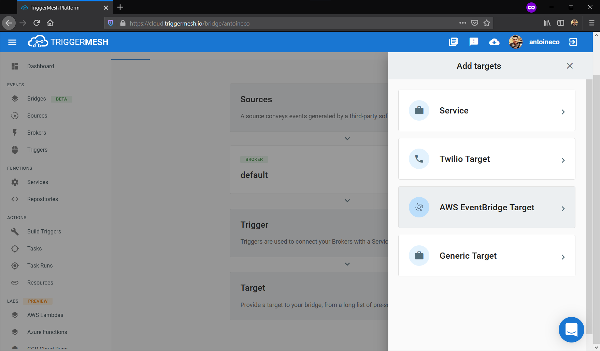
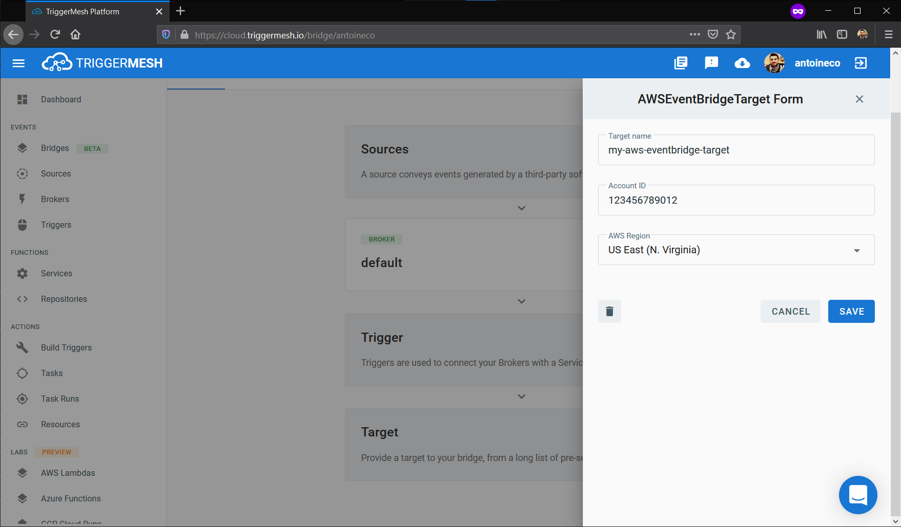
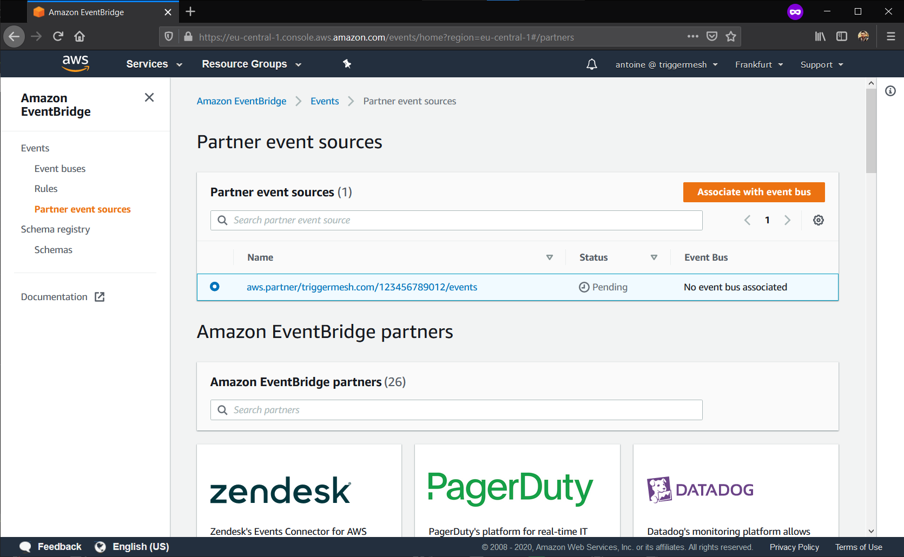
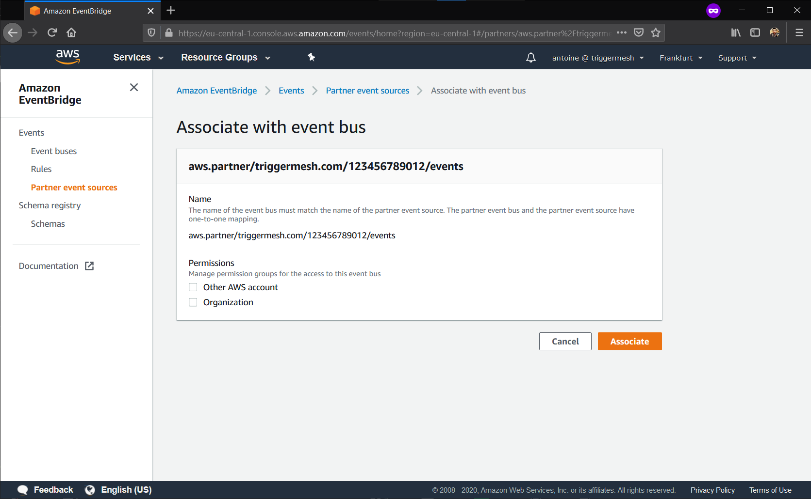
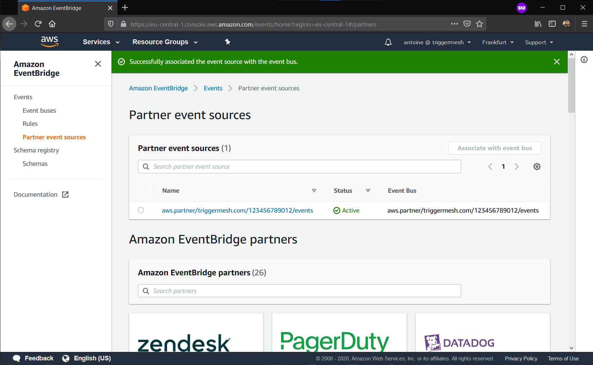
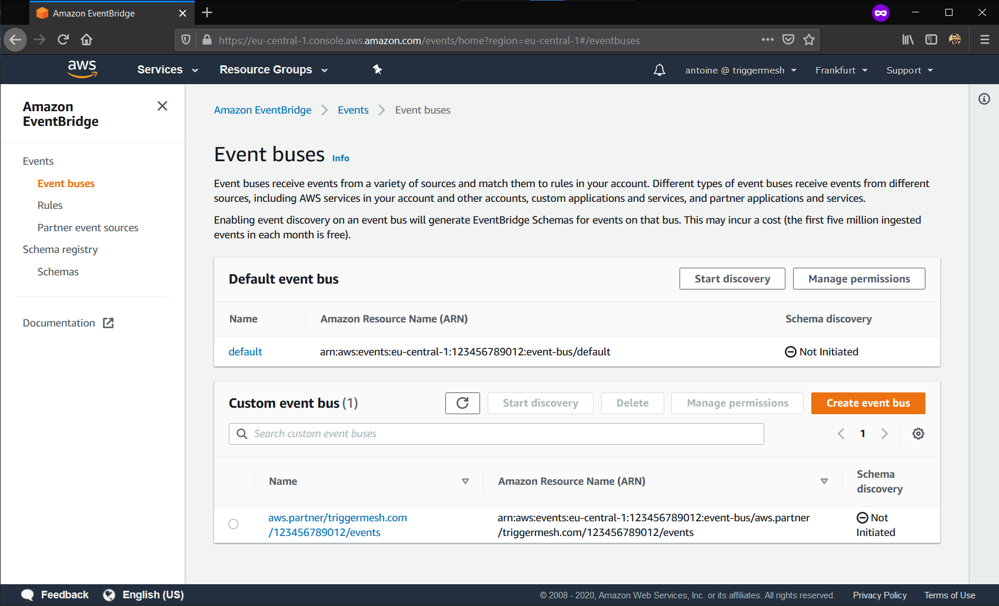

# Event target for AWS EventBridge

This event target receives arbitrary [CloudEvents][ce] over HTTP and sends them to a [AWS EventBridge partner event
bus][intro] in a [JSON format][ce-jsonformat].

## Deploying an instance of the Target

Open the Bridge creation screen and add a target of type `AWS EventBridge`.

In the Target creation form, give a name to the event Target and add the following information:

* [AWS account ID][aws-acc-id]: defines the AWS account in which the TriggerMesh partner event source is to be created.
* [AWS region][aws-regions]: defines the AWS region in which the TriggerMesh partner event source is to be created.

After clicking the `Save` button, you will be taken back to the Bridge editor. Proceed to adding the remaining
components to the Bridge, then submit it.

A ready status on the main _Bridges_ page indicates that the TriggerMesh partner event source was successfully created.

Although this event source can immediately start receiving events, those events **can only be consumed after associating
the TriggerMesh partner event source with a corresponding [partner event bus][event-bus]**.

To associate the TriggerMesh partner event source with a partner event bus:

1. Navigate to the _Partner event sources_ menu of the AWS EventBridge Console.
1. Select the "Pending" partner event source which name starts with `aws.partner/triggermesh.com`.
1. Click the `Associate with event bus` button.

On the next screen called _Associate with event bus_, click the `Associate` button.

Back to the _Partner event sources_ page, your partner event source should now show as "Active".

You will also see a custom event bus named after the TriggerMesh partner event source on the _Event buses_ page.

Your can now start creating rules that trigger on certain events in the AWS EventBridge console.

For more information about using AWS EventBridge, please refer to the [EventBridge user guide][userguide].

## Event types

The AWS EventBridge event target can consume events of any type.

[intro]: https://docs.aws.amazon.com/eventbridge/latest/userguide/what-is-amazon-eventbridge.html
[userguide]: https://docs.aws.amazon.com/eventbridge/latest/userguide/eventbridge-getting-set-up.html
[event-bus]: https://docs.aws.amazon.com/eventbridge/latest/userguide/create-event-bus.html

[aws-acc-id]: https://docs.aws.amazon.com/general/latest/gr/acct-identifiers.html
[aws-regions]: https://aws.amazon.com/about-aws/global-infrastructure/regional-product-services/

[ce]: https://cloudevents.io/
[ce-jsonformat]: https://github.com/cloudevents/spec/blob/v1.0/json-format.md
