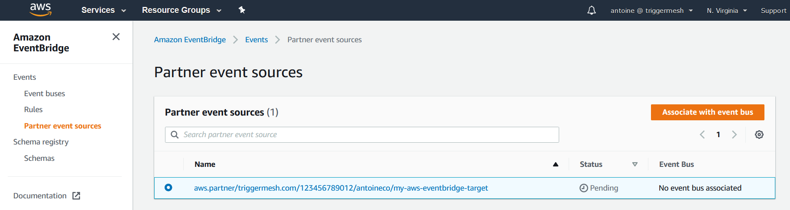
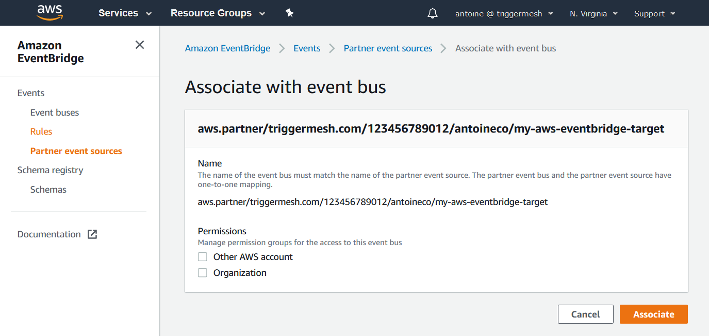
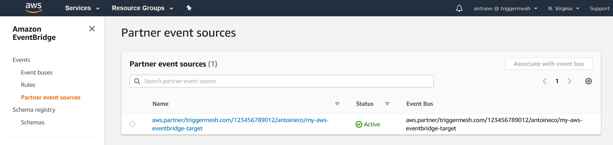
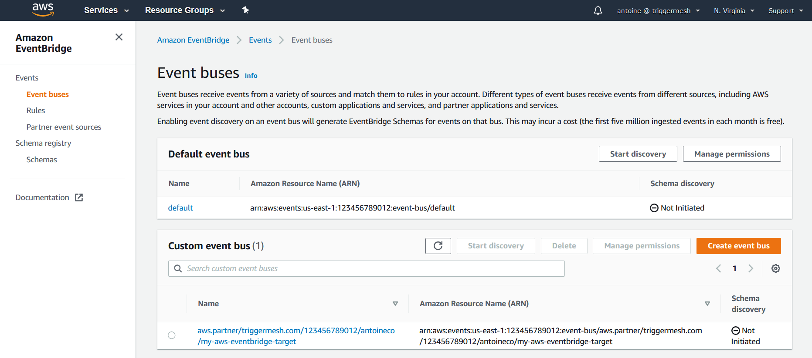

# Amazon EventBridge target

Sends events to an [Amazon EventBridge partner event
bus][intro].

With `tmctl`:

```
tmctl create target awseventbridge --arn <arn> --auth.credentials.accessKeyID <access key> --auth.credentials.secretAccessKey <secret key>
```

On Kubernetes:

Secret

```yaml
apiVersion: v1
kind: Secret
metadata:
  name: aws
type: Opaque
stringData:
  AWS_ACCESS_KEY_ID: "<AWS Access Key ID>"
  AWS_SECRET_ACCESS_KEY: "<AWS Secret Access Key>"
```

Target

```yaml
apiVersion: targets.triggermesh.io/v1alpha1
kind: AWSEventBridgeTarget
metadata:
  name: triggermesh-aws-eventbridge
spec:
  arn: arn:aws:events:us-west-2:<PROJECT_ID>:event-bus/cab-knative-event-test
  auth:
    credentials:
      accessKeyID:
        valueFromSecret:
          name: aws
          key: AWS_ACCESS_KEY_ID
      secretAccessKey:
        valueFromSecret:
          name: aws
          key: AWS_SECRET_ACCESS_KEY
```

Alternatively you can use an IAM role for authentication instead of an access key and secret (Amazon EKS only):

```yaml
auth:
  iamrole: arn:aws:iam::123456789012:role/foo
```

The Amazon EventBridge event Target can consume events of any type.

Responds with events with the following attributes:

* type `io.triggermesh.targets.aws.eventbridge.result`

See the [Kubernetes object reference](../../reference/targets/#targets.triggermesh.io/v1alpha1.AWSEventBridgeTarget) for more details.

## Prerequisites

Although this event source can immediately start receiving events, those events **can only be consumed after associating
the TriggerMesh partner event source with a corresponding [partner event bus][event-bus]**.

To associate the TriggerMesh partner event source with a partner event bus:

1. Navigate to the _Partner event sources_ menu of the Amazon EventBridge Console.
1. Select the "Pending" partner event source which name starts with `aws.partner/triggermesh.com`.
1. Click the `Associate with event bus` button.



On the next screen called _Associate with event bus_, click the `Associate` button.



Back to the _Partner event sources_ page, your partner event source should now show as "Active".



You will also see a custom event bus named after the TriggerMesh partner event source on the _Event buses_ page.



Your can now start creating rules that trigger on certain events in the Amazon EventBridge console.

For more information about using Amazon EventBridge, please refer to the [EventBridge user guide][userguide].

[intro]: https://docs.aws.amazon.com/eventbridge/latest/userguide/what-is-amazon-eventbridge.html
[userguide]: https://docs.aws.amazon.com/eventbridge/latest/userguide/eventbridge-getting-set-up.html
[event-bus]: https://docs.aws.amazon.com/eventbridge/latest/userguide/create-event-bus.html

[aws-acc-id]: https://docs.aws.amazon.com/general/latest/gr/acct-identifiers.html
[aws-regions]: https://aws.amazon.com/about-aws/global-infrastructure/regional-product-services/

[ce]: https://cloudevents.io/
[ce-jsonformat]: https://github.com/cloudevents/spec/blob/v1.0/json-format.md
