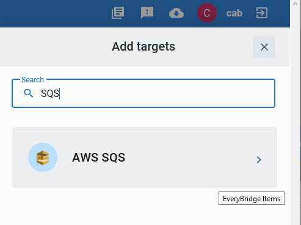

# Event Target for AWS SQS

This event Target receives [CloudEvents][ce] over HTTP and invokes an AWS
Simple Queue Service (SQS).

## Prerequisites

1. AWS API key and secret

1. ARN for the SQS queue to invoke

Consult the [Secrets](../guides/secrets.md) guide for more information about
how to add the AWS API specific secrets.

## Deploying an Instance of the Target

Open the Bridge creation screen and add a Target of type `AWS SQS`.

In the Target creation form, provide a name for the event Target, and add the following information:

* **AWS Secret**: Reference a [TriggerMesh secret][tm-secret] containing an AWS API key and Secret as discussed in the prerequisites
* **AWS ARN**: The ARN that points to the AWS SQS queue

There is an optional toggle flag indicating if the full CloudEvent should be sent
to SQS. By default, this is disabled which means the event payload
will be sent only.

After clicking the `Save` button, the console will self-navigate to the Bridge editor. Proceed by adding the remaining components to the Bridge.

After submitting the bridge, and allowing some configuration time, a green check mark on the main _Bridges_ page indicates that the bridge with the AWS SQS Target was successfully created.

For more information about using AWS Simple Queue Service, please refer to the [AWS documentation][docs].

## Event Types

The AWS SQS Target leaves the [CloudEvent][ce] type definition to the discretion of
the implementer given the nature flexible nature of AWS SQS.

However, the response [CloudEvent][ce] would have the following payload:

| Name | Value | Description |
|---|---|---|
|**ce-type**|io.triggermesh.targets.aws.sqs.result|Denotes a response payload from SQS|
|**ce-source**|`arn:aws:sqs:...`|The SQS ARN value as configured by the target|
|**body**|[JSON][ce-jsonformat]|A JSON response from the Target invocation|

[ce]: https://cloudevents.io/
[docs]: https://docs.aws.amazon.com/sqs/
[ce-jsonformat]: https://github.com/cloudevents/spec/blob/v1.0/json-format.md
