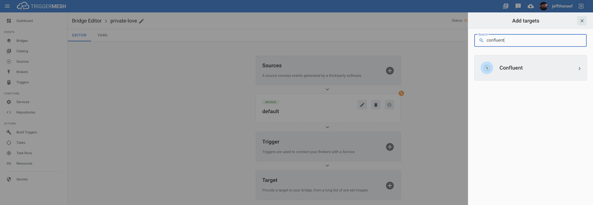
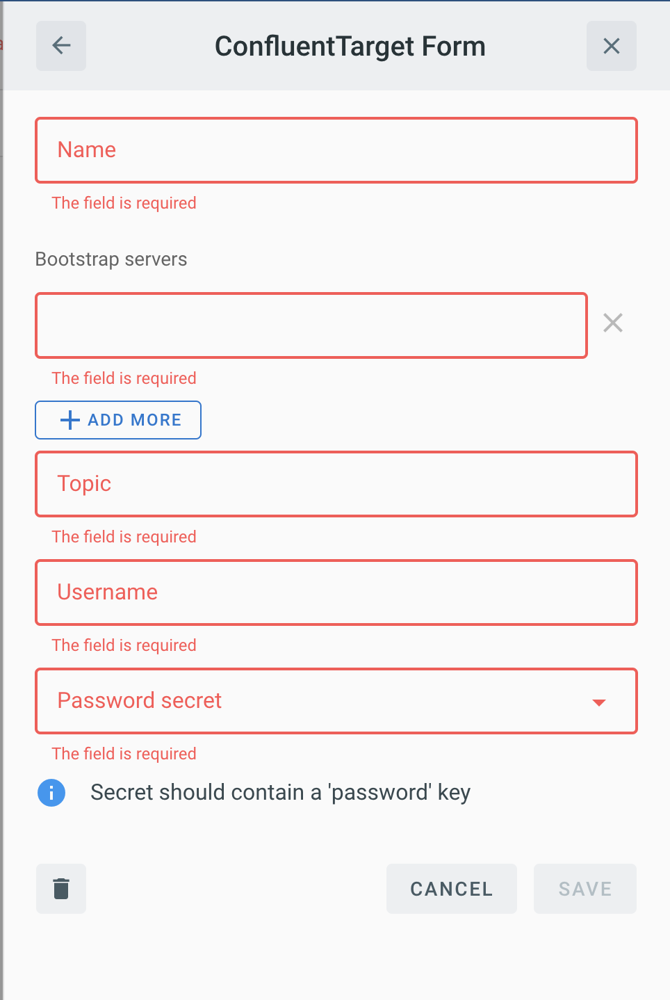

# Event Target for Confluent

This event target receives [CloudEvents][ce] and forwards the event to a Confluent Kafka cluster.

## Prerequisite(s)

- Access to a Kafka cluster with appropriate configuration details

If a password is required, consult the [Secrets](../guides/secrets.md) guide
for additional information on how to add the password as a secret.

## Kafka cluster details

Depending on the cluster and user permissions, the Kafka topic must
exist prior to setting up the target. Otherwise, the target will attempt to create
the topic which will require setting the `Topic replication` and `Topic partition`.

## Deploying an Instance of the Target

Open the Bridge creation screen and add a Target of type `Confluent`.

In the Target creation form, provide a name for the event Target and add the following information:

* **Password Secret**: Reference to a [TriggerMesh secret](../guides/secrets.md) containing the password associated with the user accessing the Kafka cluster as discussed in the prerequisites.
* **Bootstrap Servers**: Confluent bootstrap servers to connect to. Use the `ADD MORE` button to add additional bootstrap servers if needed.
* **Topic**: Confluent topic to publish events to.
* **Topic Replication**: Number of copies of the topic that should exist in the cluster.
* **Topic Partitions**: Number of partitions for the topic to allow for concurrency.
* **SASL Mechanism**: Denote how to authenticate against Kafka. Value can be either `PLAIN` or `GSSAPI`.
* **Security Protocol**: Denote whether to encrypt the password using SSL/TLS.
* **Username**: The username to connect to the Kafka cluster as. This field must have a value even if the cluster allows unauthenticated access.

There is an optional toggle flag indicating if the full CloudEvent should be sent
to Confluent. By default, this is disabled which means only the event payload
will be sent.

After clicking the `Save` button, the console will self-navigate to the Bridge editor. Proceed by adding the remaining components to the Bridge.

After submitting the Bridge, and allowing for some configuration time, a green check mark on the main _Bridges_ page indicates that the Bridge with a Confluent event Target was successfully created.

For more information on how to configure Confluent, refer to the [Confluent documentation][docs].

## Event Types

The Confluent event Target leaves the [CloudEvent][ce] type definition to the discretion of
the implementer. In addition, no events are produced as a response.

[ce]: https://cloudevents.io/
[ce-jsonformat]: https://github.com/cloudevents/spec/blob/v1.0/json-format.md
[docs]: https://docs.confluent.io/current/index.html
