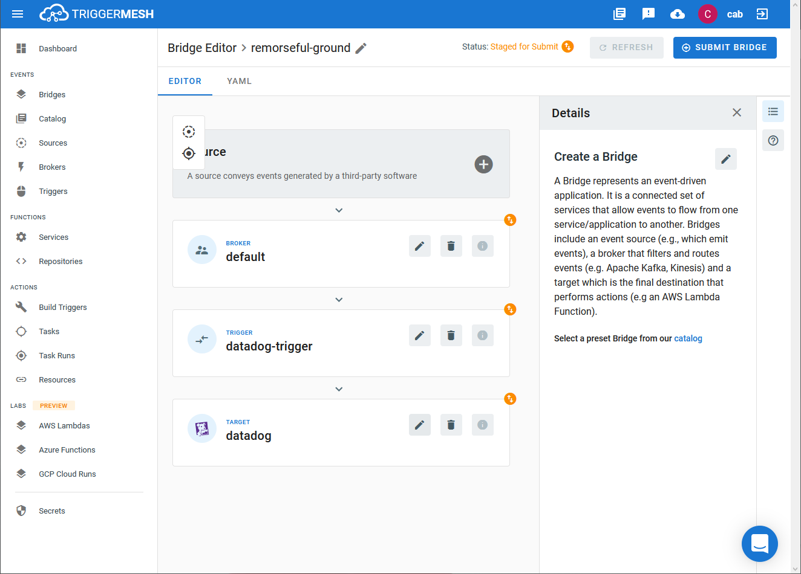

# Event Target for Datadog

This event target receives [CloudEvents][ce] and sends it to [Datadog][datadog].

## Prerequisites

1. Datadog API token

Consult the [Secrets](../guides/secrets.md) guide for more information about
how to add the Datadog API token as a secret.

## Deploying an Instance of the Target

Open the Bridge creation screen and add a Target of type `Datadog`.

In the Target creation form, provide a name to the event Target, and add the following information:

* **API Key**: Reference to a [TriggerMesh secret][tm-secret] containing the Datadog API key from above
* **Metric Name Prefix**: _Optional_ prefix to prepend to the metrics being sent

After clicking the `Save` button, the console will self-navigate to the Bridge editor. Proceed by adding the remaining components to the Bridge.

After submitting the bridge, and allowing some configuration time, a green check mark on the main _Bridges_ page indicates that the bridge with a Datadog event Target was successfully created.

For more information, please consult the [Datadog Documentation][datadog]

## Event Types

A Datadog event Target accepts the following [CloudEvent][ce] types:

### io.triggermesh.datadog.event

Events of this type are alert metrics to be published to Datadog.

This type expects a [JSON][ce-jsonformat] payload with the following properties:

| Name  |  Type |  Comment |
| ---|---|---|
| **displayName**|string|Denote name for the metric|
| **value**|float64|Numeric value of the metric|
| **resourceGroup**|string|The resource owning this type of metric|
| **timestamp**|timestamp|The timestamp of when the event occurred|
| **alertType**|string|The event type as expected by Datadog: `info`, `error`, `warning`, `success`|
| **textData**|string|Human readable description of the event|

This event type does not return an event.

### io.triggermesh.datadog.metric

Events of this type consist of a singular metric to be published to Datadog.

This type expects a [JSON][ce-jsonformat] payload with the following properties:

| Name | Type | Comment |
|---|---|---|
| **displayName**|string|Denote name for the metric|
| **value**|float64|Numeric value of the metric|
| **resourceGroup**|string|The resource owning this type of metric|
| **metricType**|string|The type of metric|

The **metricType** can be one of: `distribution`, `gauge`, or `histogram`.

This event type does not return an event.

### io.triggermesh.datadog.metric.aggregated

Events of this type consist of an array of metrics to be published to Datadog.

This type expects a [JSON][ce-jsonformat] payload with the following properties:

| Name | Type | Comment |
|---|---|---|
| **data**| io.triggermesh.datadog.metric[] | Array of multiple metrics matching the JSON payload of `io.triggermesh.datadog.metric`

This event type does not return an event.

[ce]: https://cloudevents.io/
[ce-jsonformat]: https://github.com/cloudevents/spec/blob/v1.0/json-format.md
[tm-secret]:https://docs.triggermesh.io/guides/secrets/

[datadog]: https://docs.datadoghq.com
