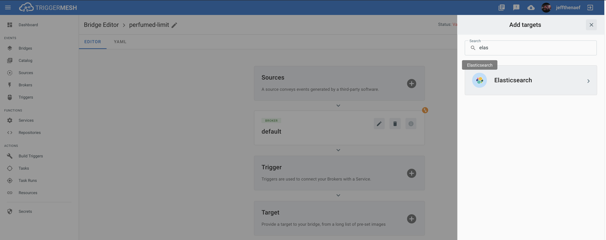
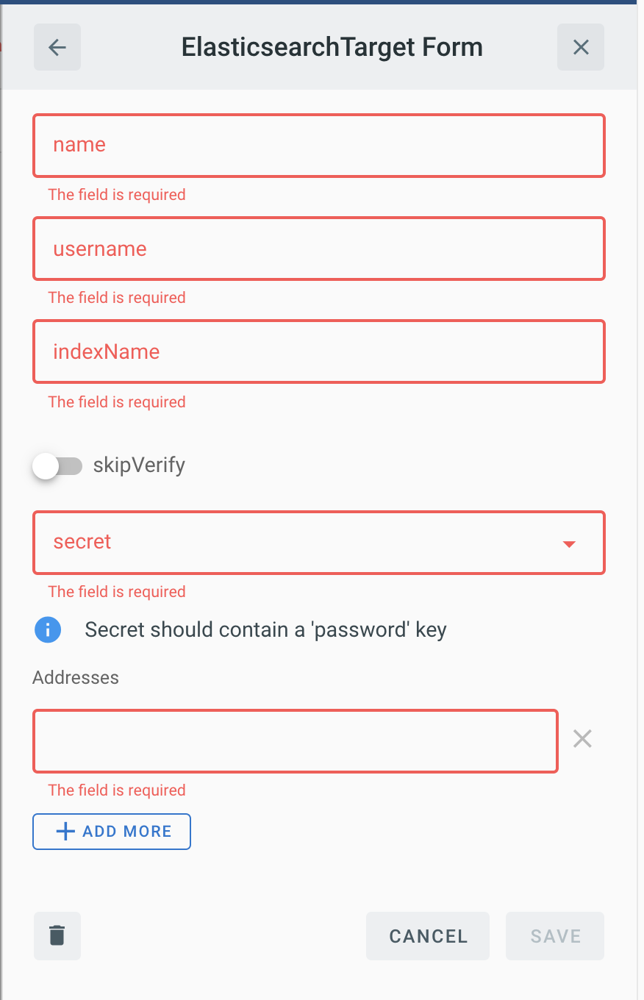

# Event Target for Elasticsearch

This event target receives [CloudEvents][ce] over HTTP and index their payload into [Elasticsearch][es]

## Prerequisites

If there is not a pre-existing Elasticsearch cluster avalible, one can get started quickly by using:

* [Elastic Cloud on Kubernetes][eck]
* [Elascic Cloud][elasticcloud]

In order to use the TriggerMesh event target for Elasticsearch, an administrator must first retrieve the proper credentials for Elasticsearch  which could be in two possible forms:

* User and password to the Elasticsearch cluster.
* An APIKey instead of User and password.

Additionaly when using a self signed certificate you will need to either inform the `CACertificate` or set the `SkipVerify` field.

## Deploying an instance of the Target

Open the Bridge creation screen and add a target of type `Elastic`.



In the Target creation form, give a name to the event Target and add the following information:

* **Username** Uername for connecting.
* **Index** : Elasticsearch index where documents will be indexed.
* **Skip verify** : Allows skipping the server certificate verification.
* **Secrete** : Reference to a [TriggerMesh secret][tm-secret] containing a CA certificate for authenticating requests
* **Addresses** : Server address list.



After clicking the `Save` button, you will be taken back to the Bridge editor. Proceed to adding the remaining
components to the Bridge, then submit it.

A ready status on the main _Bridges_ page indicates that the $TARGET target is ready to accept events.


## Events

The Elasticsearch event target can consume events of any type.

### Example

```console
curl -v http://elasticsearchtarget \
 -X POST \
 -H "Content-Type: application/json" \
 -H "Ce-Specversion: 1.0" \
 -H "Ce-Type: my.data.type" \
 -H "Ce-Source: some.origin/intance" \
 -H "Ce-Id: 536808d3-88be-4077-9d7a-a3f162705f79" \
 -d '{"message":"thanks for indexing this message","from": "Triggermesh targets", "some_number": 12}'
```

[ce]: https://cloudevents.io
[eck]: https://github.com/elastic/cloud-on-k8s
[elasticcloud]: https://www.elastic.co/cloud/
[es]:https://www.elastic.co/elasticsearch/
