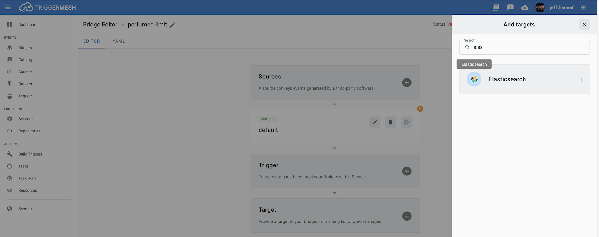
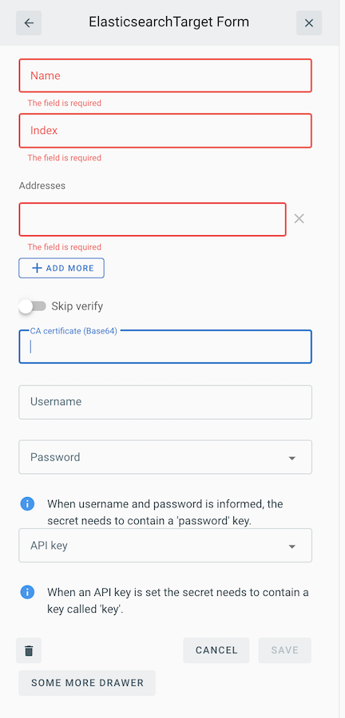

# Event Target for Elasticsearch

This event Target receives [CloudEvents][ce] over HTTP and writes their payload to an [Elasticsearch][es] index.

## Prerequisite(s)

- An Elasticsearch cluster

- Credentials for the Elasticsearch cluster in either of the following forms:
    * User and password
    * API Key

Consult the [Secrets](../guides/secrets.md) guide for more information about
how to add the Elasticsearch password and API key as secrets.

## Creating an Elasticsearch Cluster

Create an Elasticsearch cluster quickly by using either [Elastic Cloud on Kubernetes][eck] or [Elastic Cloud][elasticcloud].

## Deploying an Instance of the Target

Open the Bridge creation screen and add a Target of type `Elasticsearch`.

In the Target creation form, provide a name for the event Target and add the following information:

* **Index**: Name of the index to write documents to.
* **Addresses**: List of URLs of Elasticsearch servers.
* **Skip verify**: Allow skipping of server certificate verification.
* **CA certificate**: CA certificate to be used by the event Target's client, in PEM format.
* **Username**: Elasticsearch username.
* **Password**:  Reference a [TriggerMesh secret](../guides/secrets.md) containing a password to communicate with the Elasticsearch API, as discussed in the prerequisites.
* **API key**: Reference a [TriggerMesh secret](../guides/secrets.md) containing an API token to communicate with the Elasticsearch API, as discussed in the prerequisites.

When using a self-signed certificate you will need to either inform the **CA certificate** or set the **Skip verify** field.

After clicking the `Save` button, the console will self-navigate to the Bridge editor. Proceed by adding the remaining components to the Bridge.

After submitting the Bridge, and allowing for some configuration time, a green check mark on the main _Bridges_ page indicates that the Bridge with an Elasticsearch event Target was successfully created.

For more information about using Elasticsearch, please refer to the [Elasticsearch documentation][docs].

## Event Types

The Elasticsearch event Target can consume events of any type.

[eck]: https://github.com/elastic/cloud-on-k8s
[elasticcloud]: https://www.elastic.co/cloud/
[es]:https://www.elastic.co/elasticsearch/
[docs]:https://www.elastic.co/guide/index.html
[ce]: https://cloudevents.io
