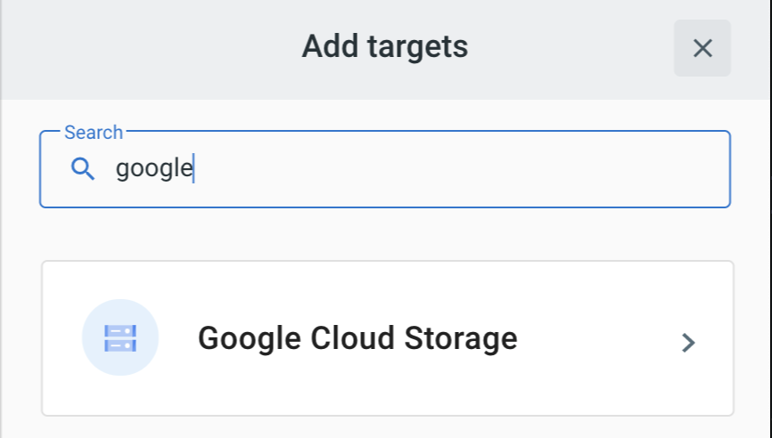
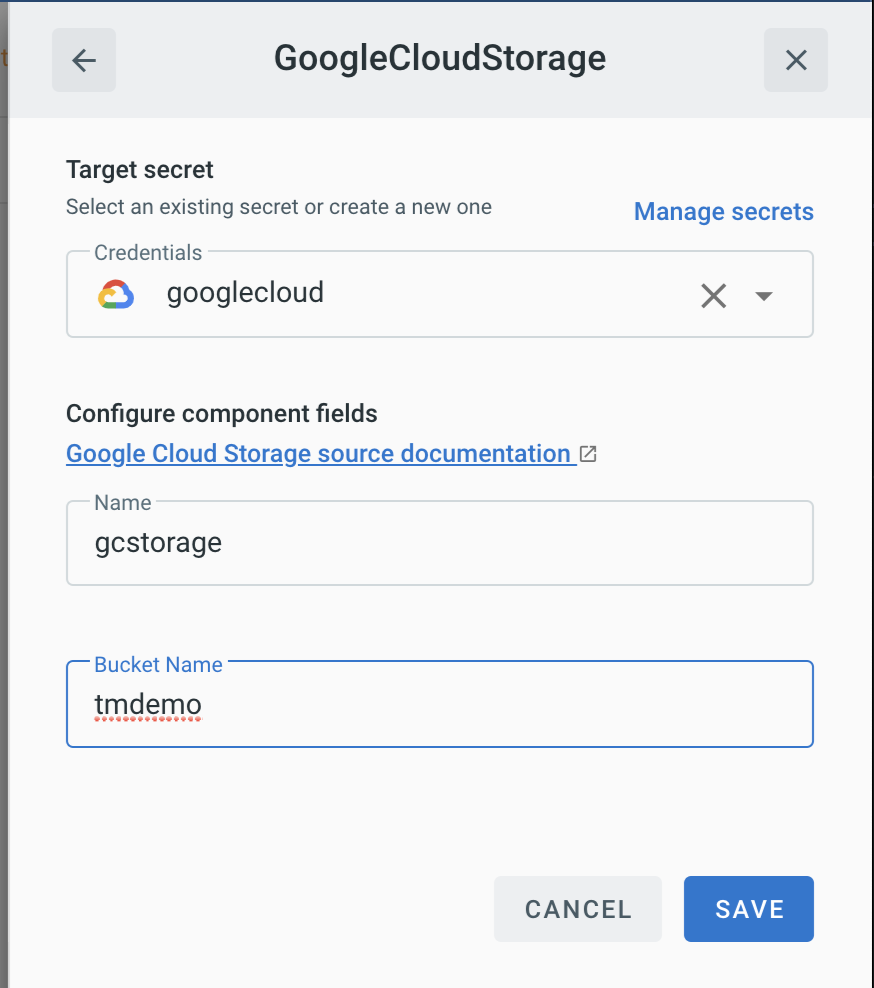

# Event Target for GoogleCloudStorage 
This event target integrates with [Google Cloud Storage](https://www.google.com/search?q=google+cloud+storage&oq=google+cloud+storage&aqs=chrome..69i57j0i433l2j69i61l3j69i65l2.1878j1j7&sourceid=chrome&ie=UTF-8), using received Cloud Event messages to create Blob items.

## Prerequisites

* A storage bucket is expected to exist prior to running this event target. If you haven't already done so, create a bucket by following the instructions from the [Cloud Storage How-To Guides](https://cloud.google.com/storage/docs/how-to).

* A [Service Account](https://cloud.google.com/iam/docs/creating-managing-service-accounts)  along with its respective [key in JSON format](https://cloud.google.com/iam/docs/creating-managing-service-account-keys) is required to authenticate the event target and allow it to interact with Google.

## Deploying an Instance of the Target
Open the Bridge creation screen and add a Target of type `Google Cloud Storage`.

In the Target creation form, provide a name for the event Target, and add the following information:

* **Credentials:**  Create a [key](https://cloud.google.com/iam/docs/creating-managing-service-account-keys) for this service account and save it. This key must be in JSON format.
* **Name:** A name to be associated with the deployed Target
* **Bucket Name:** The Google Cloud Storage Bucket name

After clicking the `Save` button, you will be taken back to the Bridge editor. Proceed by adding the remaining components to the Bridge, and then submit it.

A ready status on the main _Bridges_ page indicates that the event Target is ready to interact with Google Cloud Storage.

## Event Types
The Google Cloud Storagel event source emits events of the following type:

### Arbitrary Event Types

The GoogleCloudStorage event Target accepts any cloudevent and will upload the event's data into a file specified by it's ID. 

### Event Type com.google.cloud.storage.object.insert

The Google Cloud Storage target can also consume event's of type `com.google.cloud.storage.object.insert`, and will produced responses typed `com.google.cloud.storage.object.insert.response`. 

The payload contains a JSON structure with elements to execute the API request:

- `data`: base64 encoded data. 
- `fileName`: the file name with type (ex. 'file.png') 

[ce]: https://cloudevents.io/

[tm-secret]: ../guides/secrets.md