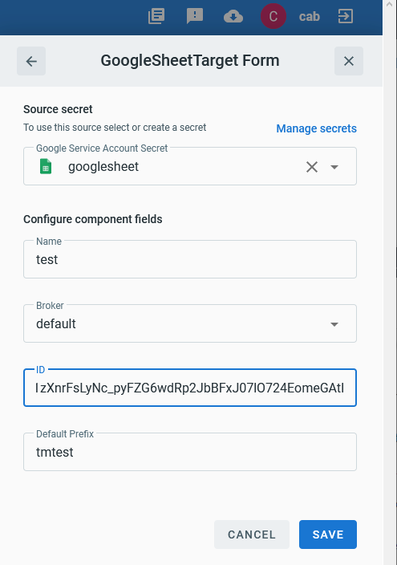
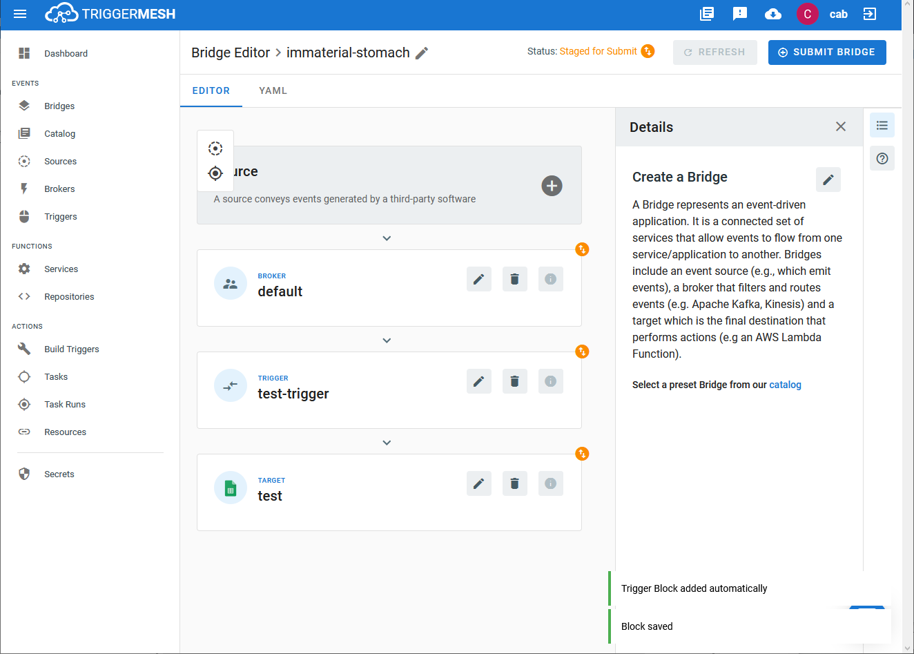

# Event Target for Google Sheets

This event target receives [CloudEvents][ce] over HTTP and appends the event payload to a GoogleSheets sheet.

## Prerequisites

1. Google API Credentials
1. GoogleSheets Sheet id

### Google API Credentials

1. Head to [Google Developers Console][google-dashboard] and create a new
 project (or select the one you have.)
2. Under “**APIs & Services > Library**”, search for “**Sheets API**” and enable it.
3. Go to “**APIs & Services > Credentials**” and choose “**Create credentials > Service account**”. (No extra roles nor
 users access is required, you can skip optional fields)
4. On the last step of service account creation download the JSON key.

Use the `client_email` field within the credentials JSON file you downloaded to share the
Google Spreadsheets you want the Target to have access to. (when sharing Notifications mark should be disabled)

Create a new Google Sheet and share it with the 'client_email' address found in the JSON key. (when sharing the "Send Notifications" mark should be disabled)

### GoogleSheet ID

Navigate to the sheet that is to be used or was just created:
- from path: `https://docs.google.com/spreadsheets/d/<SHEET_ID>/edit`
- from query string: `https://docs.google.com/spreadsheet/ccc?key=<SHEET_ID>`

## Deploying an Instance of the Target

Open the Bridge creation screen and add a Target of type `GoogleSheets`.

In the Target creation form, provide a name to the event Target, and add the following information:

* **Google Service Account Secret**: Reference to a [TriggerMesh secret][tm-secret] containing a Google API key as described in the previous section.
* **ID**: The GoogleSheets Sheet ID to send the event payload.
* **Default Prefix**: A string used during new sheet creation when the event does not provide one.

After clicking the `Save` button, the console will self-navigate to the Bridge editor. Proceed by adding the remaining components to the Bridge.

After submitting the bridge, and allowing some configuration time, a green check mark on the main _Bridges_ page indicates that the bridge with a GoogleSheets event Target was successfully created.

## Event Types

The GoogleSheets target will accept any event type, and by default, will stringify
the [CloudEvent][ce] and save the data in a new row.

### io.triggermesh.googlesheet.append

Events of this type contain nuanced data that is used to append the event data to a new row.

This type expects a [JSON][ce-jsonformat] payload with the following properties:

| Name  |  Type |  Comment |
|---|---|---|
| **sheet_name_prefix** | string | The prefix to be used for creating new sheets |
| **message** | string | A string to append to the sheet row |

[ce]: https://cloudevents.io/
[ce-jsonformat]: https://github.com/cloudevents/spec/blob/v1.0/json-format.md
[tm-secret]: ../guides/secrets/
[google-dashboard]: https://console.developers.google.com/apis/dashboard
