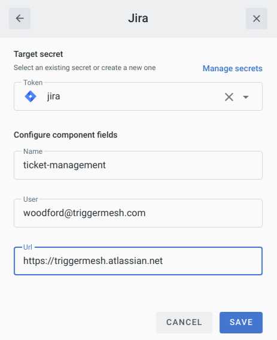

# Event Target for Jira

This event Target receives [CloudEvents][ce] and invokes a Jira endpoint.

## Prerequisite(s)

- Jira instance or Atlassian cloud tenant
- User API token

## User API token

1. Open **Account settings > Security >** [Create and Manage API Tokens][api-tokens]
2. Click `Create API token` and fill out the token name.
3. Copy the API token and create a secret for the Jira token at Triggermesh.

Consult the [Secrets](../guides/secrets.md) guide for more information about how to add a secret.

## Deploying an Instance of the Target

Open the Bridge creation screen and add a Target of type `Jira`.



In the Target creation form, provide a name for the event Target, and add the following information:

* **User**: the Jira user account that created the token.
* **URL**: base URL for the Jira instance.

After clicking the `Save` button, the console will self-navigate to the Bridge editor. Proceed by adding the remaining components to the Bridge.

After submitting the Bridge, and allowing for some configuration time, a green check mark on the main _Bridges_ page indicates that the Bridge with a Jira event Target was successfully created.


## Event Types

The Jira event Target accepts these event types:

### io.triggermesh.jira.issue.create

The Jira event Target will create an issue when receiving this event type. The CloudEvent data must contain a Jira issue JSON formatted as defined in [this schema](../schemas/jira.issue.json).

Reply contains a partially filled Jira issue with updated data.

### io.triggermesh.jira.issue.get

The Jira event Target will retrieve an issue when receiving this event type. The CloudEvent data must contain a Jira issue `GET` request JSON formatted as defined in [this schema](../schemas/jira.issue.get.json).

Reply data contains a Jira issue.

### io.triggermesh.jira.custom

The Jira event Target will send a request to the Jira API when this event type is received. The CloudEvent data expects a generic API request as defined in [this schema](../schemas/jira.custom.json).

For more information on the Jira API, please refer to the [Jira API documentation][jira-api].

## Examples

Create a custom request to retrieve Jira projects:

* **Event Type**: `io.triggermesh.jira.custom`
* **Data**:
```json
{
  "method": "GET",
  "path": "/rest/api/3/project"
}
```

List assignable users for a project:

* **Event Type**: `io.triggermesh.jira.custom`
* **Data**:
```json
{
  "method": "GET",
  "path": "/rest/api/3/user/assignable/search",
  "query": { "project": "Project1" }
}
```

Create an issue:

* **Event Type**: `io.triggermesh.jira.issue.create`
* **Data**:
```json
{
  "fields": {
    "project":
      {
        "key": "Project1"
      },
      "labels": ["triggermesh","automated"],
      "summary": "Delete this test ticket.",
      "description": "This is a test issue created using Triggermesh Jira Target",
      "issuetype": {
        "name": "Task"
      },
      "assignee": {
        "accountId": "5fe0704c9edf280075f188f0"
      }
   }
}
```

Retrieve an issue:

* **Event Type**: `io.triggermesh.jira.issue.get`
* **Data**:
```json
{ "id":"IP-9" }
```

[ce]: https://cloudevents.io/
[api-tokens]: https://id.atlassian.com/manage-profile/security/api-tokens
[ce-jsonformat]: https://github.com/cloudevents/spec/blob/v1.0/json-format.md
[jira-api]: https://developer.atlassian.com/cloud/jira/software/rest/intro/
