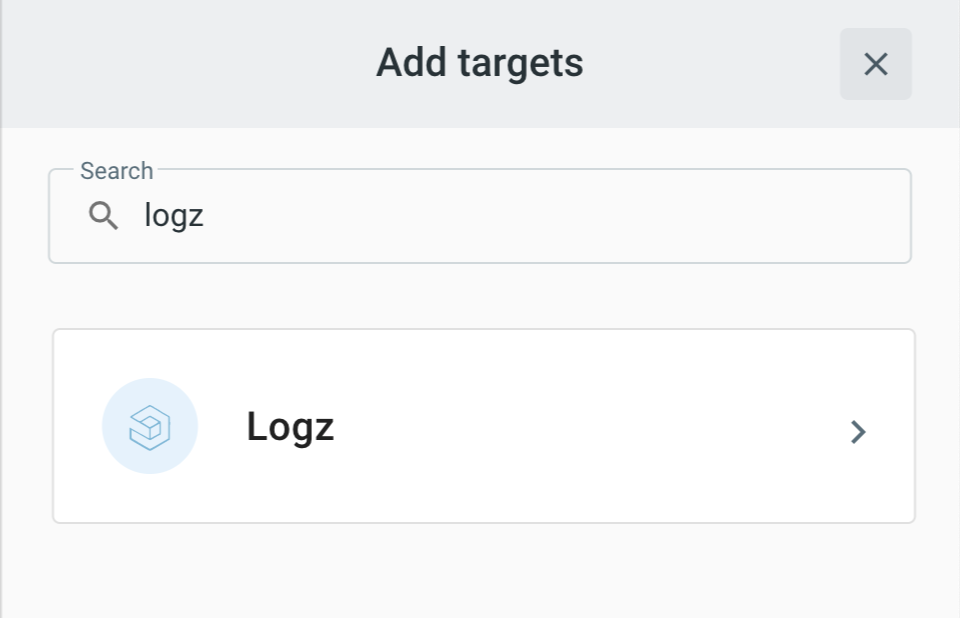

# Event Target for Logz.io

This event Target receives [CloudEvents][ce] and ships messages to [Logz.io](https://logz.io/).

## Prerequisite(s)

- Logz.io account
- Logz.io shipping [token](https://docs.logz.io/user-guide/tokens/)
- Logz.io metric shipping (if you want to ship metrics) [token](https://docs.logz.io/user-guide/accounts/finding-your-metrics-account-token/)

Consult the [Secrets](../guides/secrets.md) guide for more information about how to add the Logz.io shipping token as a secret.

## Deploying an Instance of the Target

Open the Bridge creation screen and add a Target of type `Logz`.



In the Target creation form, provide a name for the event Target, and add the following information:

* **Shipping Token**: Reference to a [TriggerMesh secret](../guides/secrets.md) containing the Logz.io [shipping token](https://docs.logz.io/user-guide/tokens/log-shipping-tokens/) as discussed in the [prerequisites](#prerequisites).
 * **Metrics Shipping Token**: Reference to a [TriggerMesh secret](../guides/secrets.md) containing the Logz.io [metrics shipping token](https://docs.logz.io/user-guide/accounts/finding-your-metrics-account-token/) as discussed in the [prerequisites](#prerequisites).
* **Logs Listener URL**: An API endpoint that can be found above your shipping token in the Logz.io dashboard.


After clicking the `Save` button, the console will self-navigate to the Bridge editor. Proceed by adding the remaining components to the Bridge.

After submitting the Bridge, and allowing for some configuration time, a green check mark on the main _Bridges_ page indicates that the Bridge with was successfully created.

## Event Types

A Logz event Target accepts the following CloudEvent types:

### Aribitrary

The Logz event Target can also consume aribtary events, and will produce responses typed `io.triggermesh.logz.ship.response`. 

## Examples

Create a Logz message:

- **Event Type**: `io.triggermesh.logz.ship`
- **Data**:
```json
{ "message":"hello world" }
```

### `io.triggermesh.logz.metrics.counter.send` 

Events of type `io.triggermesh.logz.metrics.counter.send` intend to post metrics via the counter method 
ref -> https://app.logz.io/#/dashboard/send-your-data/prometheus-sources/go-custom-metrics

| Name | Value | Description |
|---|---|---|
|**meterProvider**| string | Denotes the name of the metric as it will appear in the dashboard.|
|**metricDescription** | string | Provides a breif description of the metric.|
|**attributes**| Attributes | Attributes to assign the metric in the dashboard.|
|**metricValue**| string | Denotes the value to set for the metric.|

the Attributes struct is as follows:
```go
	Attributes struct {
		Key   string `json:"key"`
		Value string `json:"value"`
	} `json:"attributes"`
```

- **Event Type**: `io.triggermesh.logz.metrics.counter.send`
- **Data**:
```json
{"meterProvider":"triggermesh_metrics", "metricDescription":"description","metricValue": 500, "attributes":{"key":"test","value":"tv"}}
```
[ce]: https://cloudevents.io/
[ce-json]: https://github.com/cloudevents/spec/blob/v1.0/json-format.md
