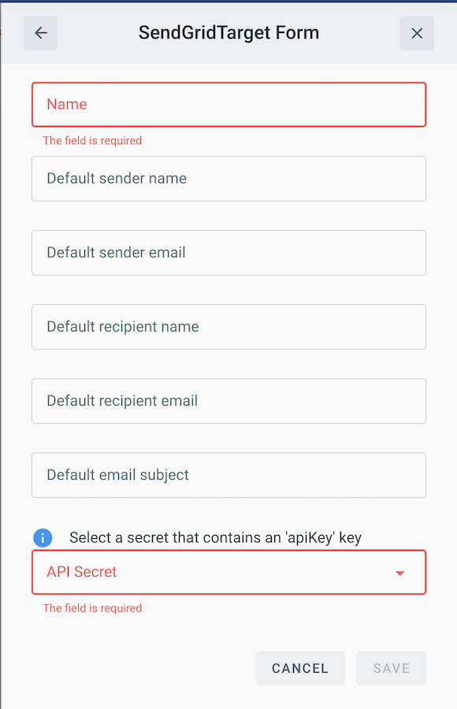

# Event Target for SendGrid

This event target receives [CloudEvents][ce] and utilizes [SendGrid][sg] to enable the creation and delivery of Email messages via event-data and event-occurrence, respectively.

## Prerequisites

* Register a [SendGrid account][sgSU]
* Retrieve a [SendGrid API token][api]

## Deploying an Instance of the Target

Open the Bridge creation screen and add a target of type `SendGrid`.


In the Target creation form, provide a name for the event Target, and add the following information:

* **Default sender name**: Define a default 'name' to be assigned in the `From:` section of the email to be created, if the received event does not contain a **FromName** property.
* **Default sender email**: Define a default email address to be assigned in the `From:` section of the email to be created, if the received event does not contain a **FromEmail** property.
* **Default recipient name**: Define a default name to be assigned in the `To:` section of the email to be created, if the received event does not contain a **FromEmail** property.
* **Default recipient email**: Define a default 'email address' to be assigned in the `To:` section of the email to be created, if the received event does not contain a **ToEmail** property.
* **Default subject**: Define a defailt subject to be assigned to the outgoing email to be created, if the received event does not contain a **ToEmail** property.
* **API Secret**: Reference to a [TriggerMesh secret][tm-secret] containing an [API token][api] for authenticating requests

**Note:** If there is not a default value specified for all of the optional fields, event recieved by that deployment *MUST* contain all of the information noted in the [Event Types](#event-types), save **Message**, or the Target **will** **fail**



After clicking the `Save` button, the console will self-navigate to the Bridge editor. Proceed by adding the remaining components to the Bridge.

After submitting the bridge, and allowing some configuration time, a green check mark on the main _Bridges_ page indicates that the bridge with a SendGrid event Target was successfully created.


For more information about using SendGrid, please refer to the [SendGrid documentation][docs].

### Event Types

Depending on how the target is to be used, defaults can be configured for all available parameters and the Target can accept arbitrary events. Or none of the defaults can be set and these parameters can be passed in at runtime via the event payload.

The SendGrid event Target accepts a [JSON][ce-jsonformat] payload with the following properties that will overwrite their respective `spec` parameters.

| Name  |  Type |  Comment | Required
|---|---|---|---|
| **FromName** | string | Sender's name |false |
| **FromEmail** | string | Sender's email | false |
| **ToName** | string | Recipient's name | false |
| **ToEmail** | string | Recipient's email | false |
| **Message** | string | Contents of the message body | false |
| **Subject** | string | Assigns a subject to the email | false |

When a **Message** property is **not** present, the entire cloud event is passed into the email `body` by default.

**Note:** If there is not a default value specified for all of the optional fields, the event received by that deployment *MUST* contain all of the information noted in the [Event Types](#event-types), save **Message**, or the Target **will** **fail**

### Example

An example email sent from the Sendgrid Target with the **Message** parameter omitted will look as follows:

```email
from: richard <richard@triggermesh.com>
to:	bob <bob@gmail.com>
date:	Sep 12, 2020, 12:41 AM
subject: Hello World

Validation: valid Context Attributes, specversion: 1.0 type: dev.knative.samples.helloworld source: dev.knative.samples/helloworldsource id: 536808d3-88be-4077-9d7a-a3f162705f79 time: 2020-09-12T04:41:00.000610299Z datacontenttype: application/json Extensions, knativearrivaltime: 2020-09-12T04:41:00.006331845Z knativehistory: default-kne-trigger-kn-channel.midimansland.svc.cluster.local Data, { "FromEmail":"richard@triggermesh.com","ToEmail":"bob@gmail.com", \
         "FromName":"richard","ToName":"bob","Subject":"Hello World" } 
```

[sgSU]:https://signup.sendgrid.com/
[sg]:https://sendgrid.com/
[api]:https://sendgrid.com/docs/ui/account-and-settings/api-keys/

[ce]: https://cloudevents.io/
[ce-jsonformat]: https://github.com/cloudevents/spec/blob/v1.0/json-format.md
[tm-secret]:https://docs.triggermesh.io/guides/secrets/
[docs]: https://sendgrid.com/docs/
