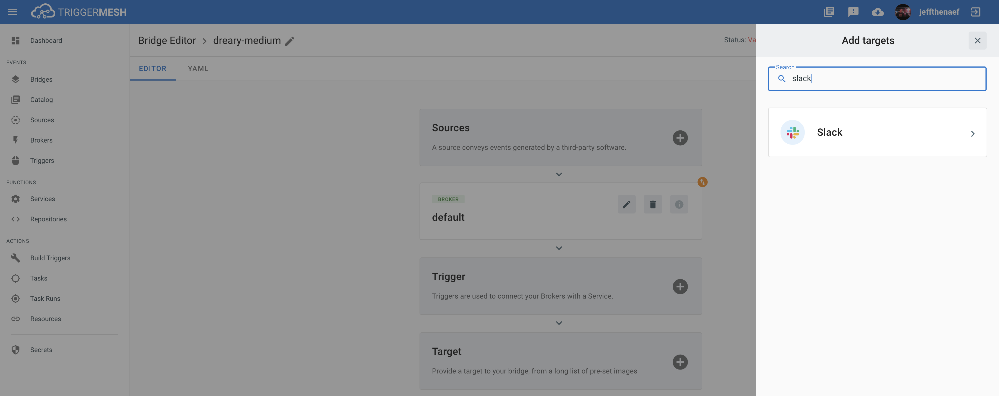

# Event Target for Slack

This event target receives [CloudEvents][ce] over HTTP and sends them to Slack using the  [Slack Web API][slack-web-api].

## Prerequisites

A Slack target requires a pre-existing `Slack App` before deployment.

First time users can configure a new `App` by following these steps before deploying the target:

1. Create a new [Slack App][slack-apps]
2. From Basic Information, Features and functionality, select the `Permissions` pane.
3. At Bot Token scopes add `chat:write`.
4. From `Install App` menu follow steps to deploy to your workspace.
5. Copy the Bot OAuth Access token, it should begin with `xoxb-...`

## Deploying an instance of the Target

Open the Bridge creation screen and add a target of type `Slack`.



In the Target creation form, give a name to the event Target and add the following information:

* **Slack token**: Reference to a [TriggerMesh secret][tm-secret] containing a token for authenticating requests

After clicking the `Save` button, you will be taken back to the Bridge editor. Proceed to adding the remaining
components to the Bridge, then submit it.

A ready status on the main _Bridges_ page indicates that the $TARGET target is ready to accept events.


For more information about using the Slack API, please refer to the [Slack documentation][docs].

## Event types

The Slack event target can consume events of type:

* `com.slack.webapi.chat.postMessage`
* `com.slack.webapi.chat.scheduleMessage`
* `com.slack.webapi.chat.update`
  
Data must be sent in a JSON format as expected by the [Slack API][docs]:

* [chat.postMessage][chat.postMessage]
* [chat.scheduleMessage][chat.scheduleMessage]
* [chat.update][chat.update]

[ce]: https://cloudevents.io/
[ce-jsonformat]: https://github.com/cloudevents/spec/blob/v1.0/json-format.md

[docs]: https://api.slack.com/#read_the_docs

## Example

Post message:

```sh
curl -v http://slack-target:8080 \
 -X POST \
 -H "Content-Type: application/json" \
 -H "Ce-Specversion: 1.0" \
 -H "Ce-Type: com.slack.webapi.chat.postMessage" \
 -H "Ce-Source: awesome/instance" \
 -H "Ce-Id: aabbccdd11223344" \
 -d '{"channel":"C01112A09FT", "text": "Hello from Triggermesh!"}'
```

Schedule message:

```sh
curl -v http://slack-target:8080 \
 -X POST \
 -H "Content-Type: application/json" \
 -H "Ce-Specversion: 1.0" \
 -H "Ce-Type: com.slack.webapi.chat.scheduleMessage" \
 -H "Ce-Source: awesome/instance" \
 -H "Ce-Id: aabbccdd11223344" \
 -d '{"channel":"C01112A09FT", "text": "Hello from scheduled Triggermesh!", "post_at": 1593430770}'
```

[ce]: https://cloudevents.io/
[slack-web-api]: https://api.slack.com/web
[slack-apps]: https://api.slack.com/apps

[chat.postMessage]: https://api.slack.com/methods/chat.postMessage
[chat.scheduleMessage]: https://api.slack.com/methods/chat.scheduleMessage
[chat.update]:  https://api.slack.com/methods/chat.update
