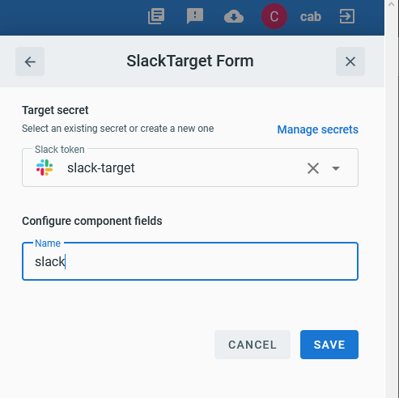

# Event Target for Slack

This event target receives [CloudEvents][ce] over HTTP and sends them to Slack using the  [Slack Web API][slack-web-api].

## Prerequisites

A Slack user that can manage applications is required to configure the target.

## Create the Slack Target Integration

Create the Slack target integration in 2 steps:

1. Configure the Slack App Bot.
2. Create the Slack Target.

### Configure the Slack App

1. Create a new [Slack App][slack-apps]
2. From Basic Information, Features and functionality, select the `Permissions` pane.
3. At Bot Token scopes add `chat:write`.
4. From `Install App` menu follow steps to deploy to your workspace.
6. Copy the Bot OAuth Access token, it should begin with `xoxb-...`

### Create the Slack Target

From TriggerMesh, open the Bridge creation screen and add a Target of type `Slack`.


In the Target creation form, provide a name for the event Target, and add the following information:

* **Slack Secret**: Reference a [TriggerMesh secret][tm-secret] containing a Slack API token



After clicking the `Save` button, the console will self-navigate to the Bridge editor. Proceed by adding the remaining components to the Bridge.


After submitting the bridge, and allowing some configuration time, a green check mark on the main _Bridges_ page indicates that the bridge with the Slack Target was successfully created.


For more information about using the Slack API, please refer to the [documentation][slack-web-api].

## Events

CloudEvents consumed by this target must be of one of these types:

- `com.slack.webapi.chat.postMessage`
- `com.slack.webapi.chat.scheduleMessage`
- `com.slack.webapi.chat.update`

Data for each of them must be a JSON message as expected by the Slack API:

- [chat.postMessage][chat.postMessage]
- [chat.scheduleMessage][chat.scheduleMessage]
- [chat.update][chat.update]

### Example

Post message:

```sh
curl -v http://slack-target:8080 \
 -X POST \
 -H "Content-Type: application/json" \
 -H "Ce-Specversion: 1.0" \
 -H "Ce-Type: com.slack.webapi.chat.postMessage" \
 -H "Ce-Source: awesome/instance" \
 -H "Ce-Id: aabbccdd11223344" \
 -d '{"channel":"C01112A09FT", "text": "Hello from Triggermesh!"}'
```

Schedule message:

```sh
curl -v http://slack-target:8080 \
 -X POST \
 -H "Content-Type: application/json" \
 -H "Ce-Specversion: 1.0" \
 -H "Ce-Type: com.slack.webapi.chat.scheduleMessage" \
 -H "Ce-Source: awesome/instance" \
 -H "Ce-Id: aabbccdd11223344" \
 -d '{"channel":"C01112A09FT", "text": "Hello from scheduled Triggermesh!", "post_at": 1593430770}'
```

[ce]: https://cloudevents.io/
[slack-web-api]: https://api.slack.com/web
[slack-apps]: https://api.slack.com/apps

[chat.postMessage]: https://api.slack.com/methods/chat.postMessage
[chat.scheduleMessage]: https://api.slack.com/methods/chat.scheduleMessage
[chat.update]:  https://api.slack.com/methods/chat.update
