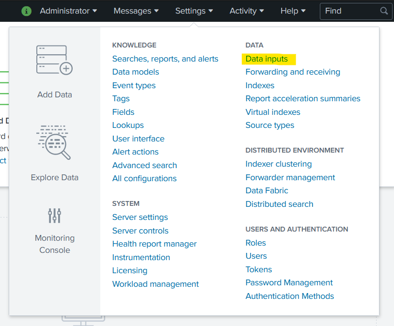
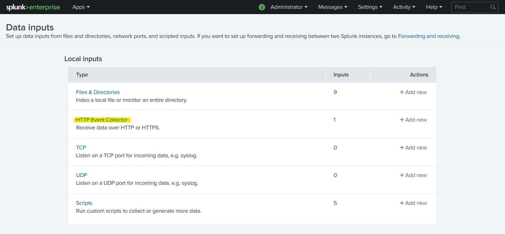
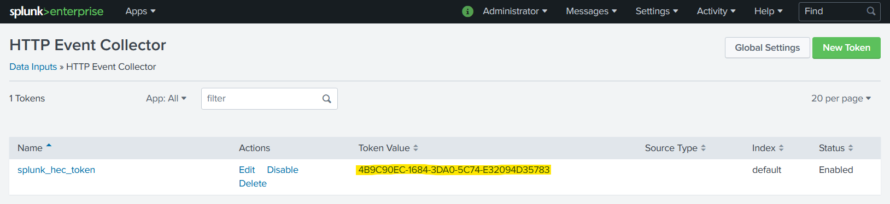
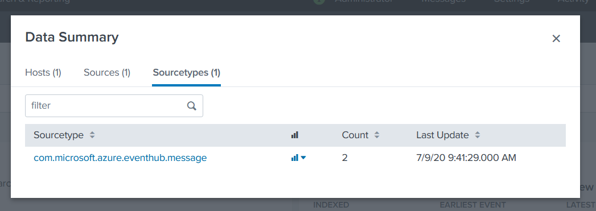
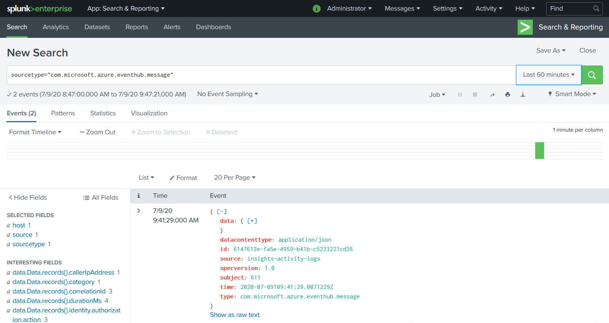

# Splunk target

Sends events to a [Splunk HTTP Event Collector][hec] (HEC).

With `tmctl`:

```
tmctl create target splunk --endpoint <endpoint> --token <token>
```

On Kubernetes:

```yaml
apiVersion: targets.triggermesh.io/v1alpha1
kind: SplunkTarget
metadata:
  name: sample
spec:
  endpoint: https://mysplunk.example.com:8088

  token:
    valueFromSecret:
      name: splunk-hec
      key: token
```

- **Endpoint**: URL of the HTTP Event Collector (HEC). This URL varies depending on the type of Splunk installation
  (Enterprise, self-service Cloud, managed Cloud). Only the scheme, hostname, and port (optionally) are evaluated, the
  URL path is trimmed if present.
- **Token**: Contains a token for authenticating requests against
  the HEC, as discussed in the [prerequisites](#prerequisites).
- [**Index**][index]: Name of the index to send events to. When undefined, events are sent to the default index defined
  in the HEC token's configuration.

Accepts events of any type.
See the [Kubernetes object reference](../../reference/targets/#targets.triggermesh.io/v1alpha1.SplunkTarget) for more details.

## Prerequisite(s)

- Enable [HTTP Event Collector][hec] Input
- HEC token

Open the Splunk web console, then navigate to **Settings > Data > Data inputs**.



In the list of local inputs, click **HTTP Event Collector**.



Click **New token** in order to generate a new token with custom settings, then take note of the value of that token. The
default HEC token (`splunk_hec_token`) is also suitable for use with the TriggerMesh event Target for Splunk.



This procedure is described in more detail in the Splunk documentation: [Set up and use HTTP Event Collector in Splunk Web][hec].

To check if you Splunk Target is working, new events should be visible in the **Search & Reporting** app inside Splunk.




For more information about using Splunk, please refer to the [Splunk documentation][docs].

[ce]: https://cloudevents.io/
[ce-jsonformat]: https://github.com/cloudevents/spec/blob/v1.0/json-format.md
[hec]: https://docs.splunk.com/Documentation/Splunk/latest/Data/UsetheHTTPEventCollector
[index]: https://docs.splunk.com/Documentation/Splunk/latest/Indexer/Aboutindexesandindexers
[docs]: https://docs.splunk.com/
