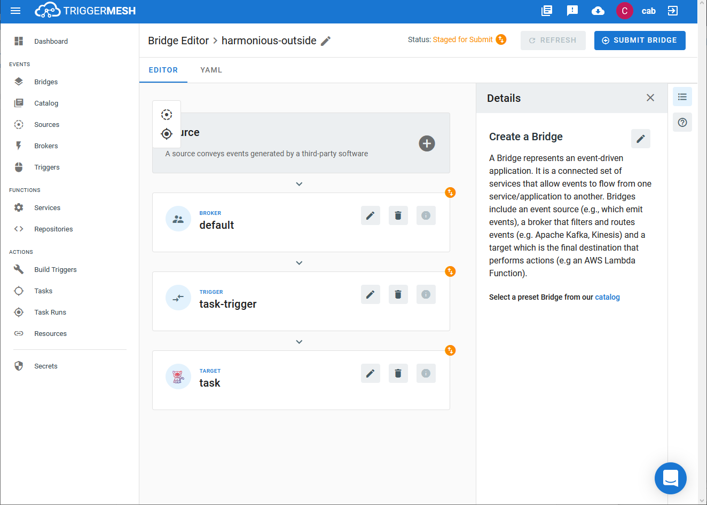

# Event Target for Tekton Pipeline

This event target receives a [CloudEvents][ce] over HTTP and will use it to
create a [Tekton][tekton] TaskRun or PipelineRun object.

## Prerequisites

A Tekton Task must exist prior to creating the Target.

## Creating a Tekton Task

From TriggerMesh, open the tasks action, and click the button to Create Task. A
menu will drop down providing the option to create the task `from YAML` or `with wizard`.
Select `with wizard`.

Give the task a name that will be referenced later on by the Target, and click
the chevron to expose the task details. Provide a name for `Step 1`, specify 
the build image to use as well as the command and arguments to run.  Click
`ADD MORE` if more steps will be required.  When finished, click `CREATE`.

The task should appear in the tasks list page.  Now to create the Target.

Refer to the [Tekton][tekton] documentation for more information about how to create
tasks and pipelines.

## Creating a Tekton Target

From TriggerMesh, open the Bridge creation screen and add a Target of type `Tekton`.

In the Target creation form, provide a name for the event Target, and click `Save`.

After clicking the `Save` button, the console will self-navigate to the Bridge editor. Proceed by adding the remaining components to the Bridge.

After submitting the bridge, and allowing some configuration time, a green check mark on the main _Bridges_ page indicates that the bridge with the Tekton Target was successfully created.

## Events

### io.triggermesh.targets.tekton

Events of this type intend to create a new Tekton `PipelineRun` or `TaskRun` object.

This type expects a [JSON][ce-jsonformat] payload with the following properties:

| Name  |  Type |  Comment |
|---|---|---|
| **buildType**| string  |  The run object type consisting of `task` or `pipeline` |
|  **name** |  string | The Tekton Task or Pipeline object to invoke  |
| **params**| map[string]string | Dictionary mapping of parameters to pass to the Tekton Task or Pipeline|

No response events are created with this Target type.

---
**NOTE:**
TaskRun and PipelineRun objects nor their associated pods are deleted after execution.
It is up to the user to perform the clean-up.

---

[ce]: https://cloudevents.io/
[tekton]: https://tekton.dev/
