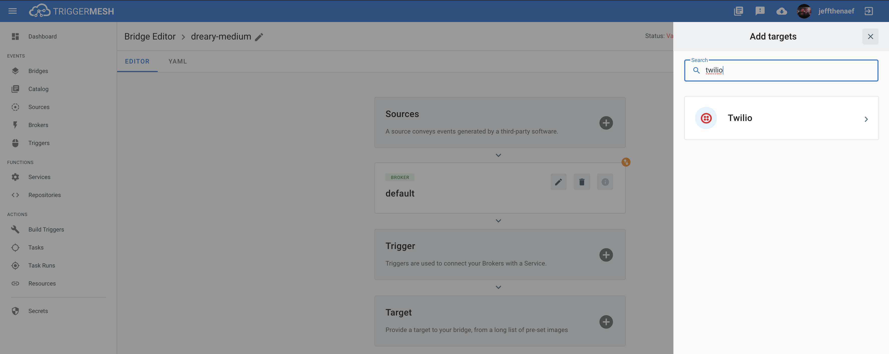
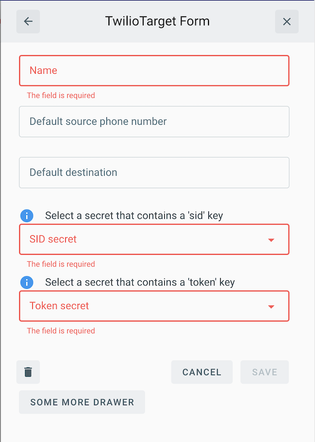

# Event Target for Twilio

This event Target receives [CloudEvents][ce] and utilizes [Twilio][landing] to enable the creation and delivery of SMS
messages via event data and event occurrence, respectively.

## Prerequisite(s)

- [Twilio][try] account with access to the [Account SID][sid] & [API Access Token][token]
- [Phone number][pn]

Consult the [Secrets](../guides/secrets.md) guide for more information about
how to add the Twilio Account SID and API Access Token as secrets.

## Deploying an Instance of the Target

Open the Bridge creation screen and add a Target of type `Twilio`.

In the Target creation form, give a name to the event Target and add the following information:

- **Default source phone number (_Optional_)**: Sender's phone number, usually configured to the [phone number][pn] purchased at
  Twilio.
- **Default destination (_Optional_)**: Phone number to send messages to by default.
- **SID Secret**: Reference to a [TriggerMesh secret](../guides/secrets.md) containing the [SID of the Twilio account][sid].
- **Token Secret**: Reference to a [TriggerMesh secret](../guides/secrets.md) containing an [API Access token][token] for
  authenticating requests against the Twilio API.

Both the **Default source phone number** and **Default destination** configurations may be overridden by any
[CloudEvent][ce] message received by the Target.

For more information about using Twilio, please refer to the [Twilio documentation][docs].

After submitting the Bridge, and allowing for some configuration time, a green check mark on the main _Bridges_ page
indicates that the Bridge was successfully created.

## Event Types

The Twilio event Target can consume events of any type, however, the Target expects a [JSON][ce-jsonformat] payload at
the [CloudEvent][ce] with the following properties:

| Name | Type | Description |
|------|------|-------------|
| **message** | string | Text to be sent in the body of the SMS message. |
| **media_urls** | string | Array of URLs pointing to JPEG, GIF or PNG resources. |
| **from** | string | Phone number sourcing the communication. Takes precedence over the value from the Twilio Target spec. |
| **to** | string | Phone number of the destination. Takes precedence over the value from the Twilio Target spec. |

[landing]: https://www.twilio.com/
[try]: https://www.twilio.com/try-twilio
[pn]: https://www.twilio.com/docs/phone-numbers
[sid]: https://www.twilio.com/docs/iam/api/account
[token]: https://www.twilio.com/docs/iam/access-tokens
[docs]: https://www.twilio.com/docs

[ce]: https://cloudevents.io/
[ce-jsonformat]: https://github.com/cloudevents/spec/blob/v1.0/json-format.md
