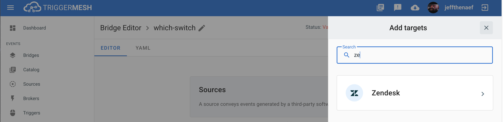
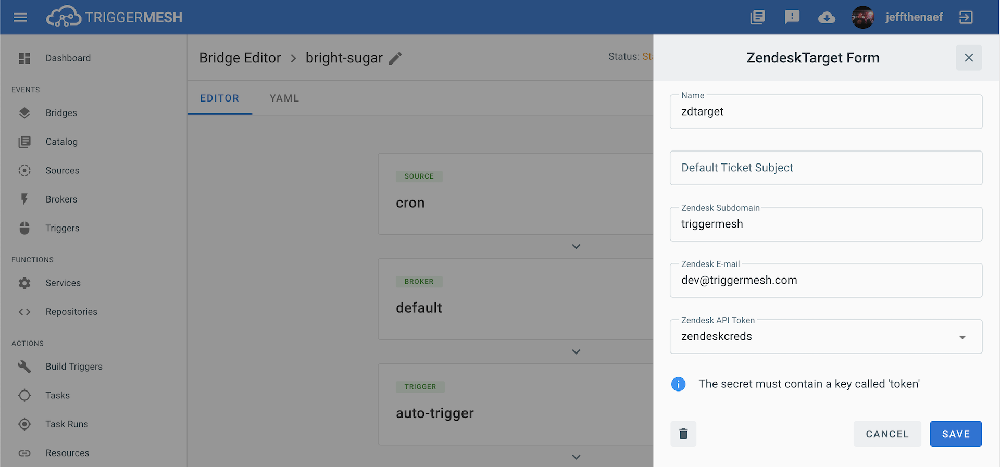
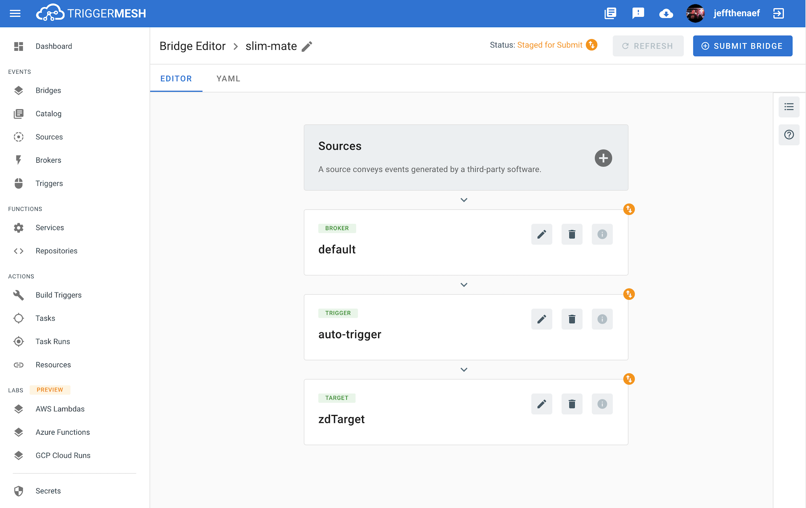

# Event Target for Zendesk

This event target receives [CloudEvents][ce] and uses the Zendesk API to either create a new ticket or tag an existing one.

## Prerequisites

A Zendesk API token is required to utilize this Target. The steps to obtain a token are outlined in the [Zendesk API Docs](https://support.zendesk.com/hc/en-us/articles/226022787-Generating-a-new-API-token-)

## Deploying an Instance of the Target

Open the Bridge creation screen and add a Target of type `Zendesk`.



In the Target creation form, provide a name to the event Target, and add the following information:

* **Default Ticket Subject**: An optional ticket subject fallback if one is not provided in an incoming event.
* **Zendesk Subdomain**: Name of the Zendesk [Subdomain][zd-subdom], without the `zendesk.com` domain or `https://` scheme.
* **Zendesk Email**: Email address associated with the Zendesk account.
* **Zendesk API Token**: Reference to a [TriggerMesh secret][tm-secret] containing a [token][zd-token] to communicate with the Zendesk API, as described in the previous section.



After clicking the `Save` button, the console will self-navigate to the Bridge editor. Proceed by adding the remaining components to the Bridge.



After submitting the bridge, and allowing some configuration time, a green check mark on the main _Bridges_ page indicates that the bridge with a Zendesk event Target was successfully created.


For more information about using Zendesk, please refer to the [Zendesk documentation][docs].

## Event Types

A Zendesk event Target accepts the following [CloudEvent][ce] types:

### com.zendesk.ticket.create

Events of this type intend to create a new Zendesk ticket.

This type expects a [JSON][ce-jsonformat] payload with the following properties:

| Name  |  Type |  Comment |
|---|---|---|
| **subject**| string  |  The value of the subject field for this ticket |
|  **body** |  string | The value of the body field for this ticket  |

An example response from the Zendesk Target after consuming an event of this type:

```json
{
 "id":165,
 "url":"https://triggermesh.zendesk.com/api/v2/tickets/165.json",
 "subject":"Hello",
 "raw_subject":"Hello",
 "description":"World",
 "status":"open",
 "requester_id":412584624334,
 "submitter_id":412584624334,
 "assignee_id":412584624334,
 "group_id":360010761434,
 "due_at":"0001-01-01T00:00:00Z",
 "via":
   {
     "channel":"api",
     "source":{"from":{},"to":{},"rel":""}},
     "satisfaction_rating":{"id":0,"score":"","comment":""},
     "brand_id":360004879834,
     "allow_attachments":true,
     "is_public":true,
     "created_at":"2020-08-05T20:00:11Z",
     "updated_at":"2020-08-05T20:00:11Z",
     "collaborators":{},
     "comment":{"created_at":"0001-01-01T00:00:00Z"
   }
}
```

### com.zendesk.tag.create

Events of this type intend to assign a [tag][zd-tag] to a pre-existing Zendesk ticket.

This type expects a [JSON][ce-jsonformat] payload with the following properties:

| Name  |  Type |  Comment |
|---|---|---|
| **id** | int64 | The value of the id field for the ticket to be updated |
| **tag** | string | The value of the tag to assign to this ticket |

[ce]: https://cloudevents.io/
[ce-jsonformat]: https://github.com/cloudevents/spec/blob/v1.0/json-format.md
[tm-secret]:https://docs.triggermesh.io/guides/secrets/

[docs]: https://developer.zendesk.com/rest_api

[zd-token]: https://support.zendesk.com/hc/en-us/articles/226022787-Generating-a-new-API-token-
[zd-subdom]: https://support.zendesk.com/hc/en-us/articles/221682747-Where-can-I-find-my-Zendesk-subdomain-
[zd-tag]:https://support.zendesk.com/hc/en-us/articles/203662096-About-tags
