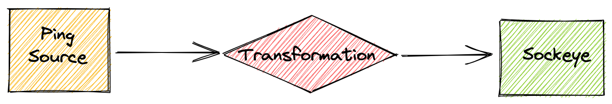

# JSON transformation with Bumblebee

## Introduction to the Bumblebee transformation language

A Bumblebee transformation consists of two main parts: "context" and "data" for corresponding [CloudEvents](https://github.com/cloudevents/spec/blob/v1.0/spec.md) components.

Bumblebee supports `Delete`, `Add`, `Shift`, and `Store` operations.

Transformation operations are applied on the event in the order they are listed in the spec with the  exception of `Store` which runs before the rest to be able to collect variables for the runtime.

### Delete

Delete CE keys or objects.

**Delete a key**

Delete a key.

```yaml
spec:
  data:
  - operation: delete
    paths:
    - key: foo
    - key: array[1].foo
    - key: foo.array[5]
```

**Delete a key if**

Delete a "foo" key only if its value is equal to "bar".

```yaml
spec:
  data:
  - operation: delete
    paths:
    - key: foo
      value: bar
```

**Delete recursively**

Recursively remove all keys with specified value.

```yaml
spec:
  data:
  - operation: delete
    paths:
    - value: leaked password
```

**Delete everything**

Delete everything. Useful for composing completely new CE
using stored variables.

```yaml
spec:
  data:
  - operation: delete
    paths:
    - key:
```

### Add

Add new or override existing CE keys.

**Override the event type**

Override Cloud Event type. This operation can be used to implement
complex Transformation logic with multiple Triggers and CE type
filtering.

```yaml
spec:
  context:
  - operation: add
    paths:
    - key: type
      value: ce.after.transformation
```

**Add a new object**

Add a new object with nested structure.

```yaml
spec:
  data:
  - operation: add
    paths:
    - key: The.Ultimate.Questions.Answer
      value: "42"
```

**Add or modify arrays**

Add arrays or modify existing ones. "True" will be added as
a second item of a new array "array" in a new object "newObject".
"1337" will be added as a new key "newKey" as a first item of an
existing array "commits".

```yaml
spec:
  data:
  - operation: add
    paths:
    - key: newObject.array[2]
      value: "true"
    - key: commits[1].newKey
      value: "1337"
```

**Add using variables**

"Add" operation supports value composing from variables and
static strings.

```yaml
spec:
  data:
  - operation: add
    paths:
    - key: id
      value: ce-$source-$id
```

**Conditional Add operation**

Conditionally add a new value depending on whether or not a stored variable is instantiated.

```yaml
spec:
  data:
  - operation: store
    paths:
      - key: $name
        value: user.name
  - operation: add
    paths:
      - key: message
        value: (hello $name)  
      - key: detail
        value: hello(.$source)
```

In this example, the value of `message` will either be `hello <name>` or an empty string if `$name` is not set.

The value of `detail` will either be `hello.<source>` or `hello` if `$source` is not set.

### Shift

Move existing CE values to new keys.

**Shift one key's value to another**

Move value from "foo" key to "bar"

```yaml
spec:
  data:
  - operation: shift
    paths:
    - key: foo:bar
```

**Shift if**

Move key only if its value is equal to "bar".

```yaml
spec:
  data:
  - operation: shift
    paths:
    - key: old:new
      value: bar
```

**Shift nested objects and arrays**

Shift supports nested objects and arrays:

```yaml
spec:
  data:
  - operation: shift
    paths:
    - key: array[0].id:newArray[1].newId
    - key: object.list[0]:newItem
```

### Store

Store CE value as a pipeline variable. Useful in combination with
the other operations. The variables are shared between the "context"
and the "data" parts of the transformation pipeline.

**Store and use event type and source**

Store CE type and source and add them into headers array in a payload.
Also set a new CE type and save the original one in context extensions.

```yaml
spec:
  context:
  - operation: store
    paths:
    - key: $ceType
      value: type
    - key: $ceSource
      value: source
  - operation: add
    paths:
    - key: type
      value: ce.after.transformation
    - key: extensions.OriginalType
      value: $ceType
  data:
  - operation: add
    paths:
    - key: headers[0].source
      value: $ceSource
    - key: headers[1].type
      value: $ceType
```

### CloudEvents extensions

CloudEvent's context extensions can be accessed by using the `extensions.*` key prefix, for example below we show how to add a new CloudEvents extension attribute to the event:

```yaml
context:
  - operation: add
    paths:
    - key: extensions.profile
      value: something
```

You can delete all extension attributes by using the following syntax:

```yaml
context:
  - operation: delete
    paths:
    - key: Extensions
```

### Using a custom JSON path separator

By default the `.` character is used as a JSON path separator, i.e. the foo.bar key is interpreted as a "foo":{"bar":...} object. The custom JSON path separator provides a way to replace `.` with any character, so that if a key's full name contains a `.`, such as `property.name`, it can be consider as a property name instead of a nested object.

```yaml
spec:
  data:
  - operation: add
    paths:
    - key: body/property.name/attribute
      value: "my value"
      separator: /
```

In the above example, the output will be a new JSON object in which property.name is the name of an attribute:

```json
{
  "body": {
    "property.name": {
      "attribute": "my value"
    }
  }
}
```

## Kubernetes tutorial

In this Kubernetes guide, we will create a
simple Bridge with an event producer and a transformation to see the declarative syntax that is used for modifying events.

!!! tip
    You can verify that the API is available with the following command:

    ```console
    $ kubectl get crd transformations.flow.triggermesh.io
    NAME                                  CREATED AT
    transformations.flow.triggermesh.io   2021-10-06T09:01:40Z
    ```

    You can also explore the API specification with:
    ```console
    $ kubectl explain transformation
    ```




Let's create all the required objects:

- [x] The sockeye target which serves as an event display.
- [x] The `PingSource` which serves as an event producer.
- [x] The `Transformation` to modify the produced events.

### Event display

First of all, we need to have a tool to see the transformed events. Create a `sockeye`
service by saving the following YAML manifest in a file called `sockeye.yaml` and applying it to your Kubernetes cluster:

```yaml
apiVersion: serving.knative.dev/v1
kind: Service
metadata:
  name: sockeye
spec:
  template:
    spec:
      containers:
        - image: docker.io/n3wscott/sockeye:v0.7.0@sha256:e603d8494eeacce966e57f8f508e4c4f6bebc71d095e3f5a0a1abaf42c5f0e48
```

```
kubectl apply -f sockeye.yaml
```

Open the web interface in a browser at the URL that you find with the following command:

```shell
$ kubectl get ksvc sockeye -o=jsonpath='{.status.url}'
```

### Events producer

Next, we need to create a
[PingSource](https://knative.dev/docs/developer/eventing/sources/ping-source) to
produce CloudEvents by saving the following YAML manifests in a file and applying it to your Kubernetes cluster with `kubectl apply`:

```yaml
apiVersion: sources.knative.dev/v1
kind: PingSource
metadata:
  name: ps-transformation-demo
spec:
  schedule: "*/1 * * * *"
  contentType: "application/json"
  data: '{
    "First Name": "Alice",
    "Last Name": "Wonderland",
    "Date of birth": {
      "year": 1955,
      "month": 1,
      "day" : 23
    },
    "Married": true,
    "Children":
    [
        {"Name": "Martin", "Year of birth": 1980},
        {"Name": "Margaret", "Year of birth": 1983}
    ],
    "Mobile phone": null
  }'
  sink:
    ref:
      apiVersion: flow.triggermesh.io/v1alpha1
      kind: Transformation
      name: trn-transformation-demo
```

### Transformation

And finally the transformation object that will receive CloudEvents from
the PingSource defined above, apply its operations and forward modified events to
the `sockeye` service:

```yaml
apiVersion: flow.triggermesh.io/v1alpha1
kind: Transformation
metadata:
  name: trn-transformation-demo
spec:
  sink:
    ref:
      apiVersion: serving.knative.dev/v1
      kind: Service
      name: sockeye

  context:
  - operation: store
    paths:
    - key: $time
      value: time
    - key: $id
      value: id
  - operation: add
    paths:
    - key: id
      value: $person-$id
    - key: type
      value: io.triggermesh.transformation.pingsource

  data:
  - operation: store
    paths:
    - key: $person
      value: First Name
  - operation: add
    paths:
    - key: event.ID
      value: $id
    - key: event.time
      value: $time
  - operation: shift
    paths:
    - key: Date of birth:birthday
    - key: First Name:firstname
    - key: Last Name:lastname
  - operation: delete
    paths:
    - key: Mobile phone
    - key: Children[1].Year of birth
    - value: Martin
```

Once created with `kubectl apply` verify that the transformation is ready:

```console
$ kubectl get transformation -w
NAME                      ADDRESS                                                   READY   REASON
trn-transformation-demo   http://trn-transformation-demo.sebgoa.svc.cluster.local   True
```

If all the components of the Bridge are ready, the `sockeye` web interface will start showing modified events shortly:


You will notice that the CloudEvent attributes have beeen modified according to the `context` section in the specification of the `Transformation` object. The event type was modified and the `id` was prepended with the string `Alice`.

The payload was also transformed according to the `data` section of the `Transformation` object. For example the mobile phone was deleted, a key `event` was added and a few keys were _shifted_: "Date of Birth" became "birthday".

!!! tip "Play with your Transformation as Code"
    You can play around by modifying the `Transformation` object and re-applying it with `kubectl`. This gives you a declarative event transformer which you can manage with your [GitOps workflow](https://www.weave.works/technologies/gitops/).
