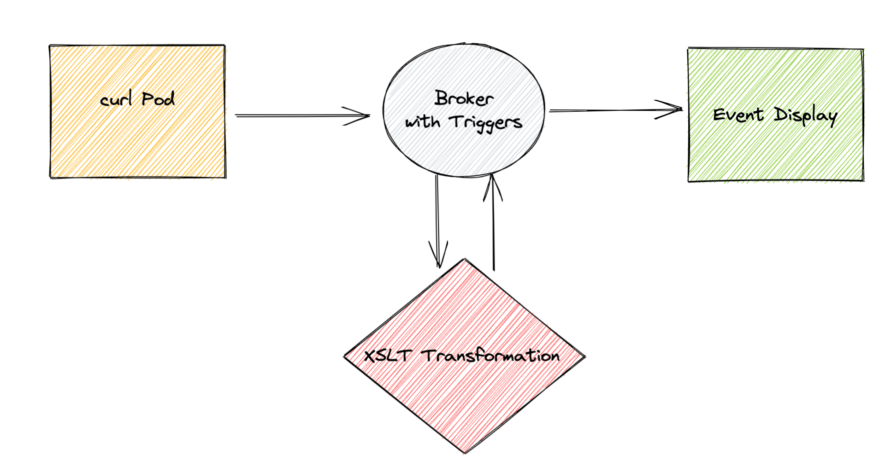

# Transforming XML Using XSLT
The Trigermesh `XSLTTransformation` API object can be used to process a Cloudevent containing XML and transform the document using [XSLT](https://developer.mozilla.org/en-US/docs/Web/XSLT).

!!! info "Work in progress"
    This component is not yet available with `tmctl`.

## Configuring a XSLT Transformation Event Flow

This guide shows you how to configure an event flow that transforms an incoming CloudEvent in XML by parsing it with an XSLT stylesheet. It has five steps:

* Deploy a Broker that will receive the transformed data.
* Deploy the `EventDisplay` service.
* Deploy the `XSLTTransformation` object.
* Configure the [Triggers](https://knative.dev/docs/eventing/broker/triggers/)
* Deploy a curl pod that will allow us to send events to the broker.



An `XSLTTransformation` object can be configured to either reply to the event sender or to send the
transformed data to a `Sink`, if one is provided. In this guide, we will deploy without a `Sink` and
configure the replies from the transformation to route to the `EventDisplay` service using a `Trigger`.

The transformation needs to be configured with a valid XSLT document. In this guide we will use the following XSLT:

```xml
<xsl:stylesheet version="1.0"	xmlns:xsl="http://www.w3.org/1999/XSL/Transform">
  <xsl:template match="tests">
    <output>
      <xsl:apply-templates select="test">
        <xsl:sort select="data/el1"/>
        <xsl:sort select="data/el2"/>
      </xsl:apply-templates>
    </output>
  </xsl:template>

  <xsl:template match="test">
    <item>
      <xsl:value-of select="data/el1"/>
      <xsl:value-of select="data/el2"/>
    </item>
  </xsl:template>
</xsl:stylesheet>
```

It transforms the following XML:
```xml
<tests>
  <test>
    <data>
      <el1>A</el1>
      <el2>1</el2>
    </data>
  </test>
  <test>
    <data>
      <el1>B</el1>
      <el2>2</el2>
    </data>
  </test>
  <test>
    <data>
      <el1>C</el1>
      <el2>3</el2>
    </data>
  </test>
</tests>
```

Into this new XML document:
```xml
<?xml version="1.0"?>
<output>
  <item>A1</item>
  <item>B2</item>
  <item>C3</item>
</output>
```

Let's go step by step.

### Deploy the Broker
Deploy a Broker by writing the following YAML in a file:
```yaml
apiVersion: eventing.knative.dev/v1
kind: Broker
metadata:
  name: demo
```

Create the Broker with the following command:
```console
kubectl apply -f <manifest.yaml>
```

### Deploying the `EventDisplay` Service
Let's now deploy the end of our event flow. The `EventDisplay` is a simple application that can be used to display CloudEvents. It can
be deployed by writing the following YAML in a file and using `kubectl apply -f <manifest.yaml>`:

```yaml
apiVersion: serving.knative.dev/v1
kind: Service
metadata:
    name: event-display
spec:
  template:
    spec:
      containers:
        - image: gcr.io/knative-releases/knative.dev/eventing-contrib/cmd/event_display@sha256:46d5a66f300c3ced590835d379a0e9badf413ae7ab60f21a2550ecedbc9eb9d3
```

### Deploy the `XSLTTransformation` Object
With the `event-display` in place, the `XSLTTransformation` object can now be deployed in the same manner using the following manifest:

!!! Note
    The XSLT is written in-line within the YAML manifest

```yaml
apiVersion: flow.triggermesh.io/v1alpha1
kind: XSLTTransformation
metadata:
  name: demo
spec:
  allowPerEventXSLT: true
  xslt:
    value: |
      <xsl:stylesheet version="1.0"	xmlns:xsl="http://www.w3.org/1999/XSL/Transform">
        <xsl:template match="tests">
          <output>
            <xsl:apply-templates select="test">
              <xsl:sort select="data/el1"/>
              <xsl:sort select="data/el2"/>
            </xsl:apply-templates>
          </output>
        </xsl:template>

        <xsl:template match="test">
          <item>
            <xsl:value-of select="data/el1"/>
            <xsl:value-of select="data/el2"/>
          </item>
        </xsl:template>
      </xsl:stylesheet>
```

### Configure the Triggers
Next, Triggers need to be configured to route our Cloudevents to the `XSLTTransformation` and `EventDisplay` objects. This can be done by writing the following YAML in a file and using `kubectl apply -f <manifest.yaml>`. We have two triggers, one to send events containing XML to the transformation and one to send all events to the event display.

```yaml
kind: Trigger
apiVersion: eventing.knative.dev/v1
metadata:
  name: event-display
spec:
  broker: demo
  subscriber:
    ref:
      apiVersion: serving.knative.dev/v1
      kind: Service
      name: event-display
---
kind: Trigger
apiVersion: eventing.knative.dev/v1
metadata:
  name: xslttransformation-xmldoc
spec:
  broker: demo
  filter:
    attributes:
      # setting a filter to process only events of type `xml.document`
      type: xml.document
  subscriber:
    ref:
      apiVersion: flow.triggermesh.io/v1alpha1
      kind: XSLTTransformation
      name: demo
```

### Deploy a Curl Pod
Finally, an event source can be depoyed that will emit CloudEvents with XML data in the payload. We can do this in two steps:

    1. Deploy a curl pod that will emit the CloudEvents by writing the following YAML in a file and apply it with `kubectl apply -f <manifest.yaml>`.

```yaml
apiVersion: v1
kind: Pod
metadata:
  labels:
    run: curl
  name: curl
spec:
  containers:
  - image: radial/busyboxplus:curl
    imagePullPolicy: IfNotPresent
    name: curl
    stdin: true
    tty: true
```

    2. Execute the following command to emit a cloudevent to the broker we created:

```cmd
kubectl exec -ti curl -- curl -v "http://broker-ingress.knative-eventing.svc.cluster.local/default/demo" \
  -H "Ce-Specversion: 1.0" \
  -H "Ce-Type: xml.document" \
  -H "Ce-Source: curl.shell" \
  -H "Content-Type: application/xml" \
  -H "Ce-Id: 1234-abcd" \
  -d '<tests><test><data><el1>A</el1><el2>1</el2></data></test><test><data><el1>B</el1><el2>2</el2></data></test><test><data><el1>C</el1><el2>3</el2></data></test></tests>'
```


### Viewing the Transformation's Output in the Event Display
With our event flow in place, we can now view the transformed data in the `EventDisplay`.

We need to retrieve the `EventDisplay` Pod name by running the following command:

```cmd
kubectl get pods                                                          
NAME                                                   READY   STATUS    RESTARTS   AGE
curl                                                   1/1     Running   0          4m36s
event-display-00001-deployment-74bf8556b7-t7lxw        2/2     Running   0          3s
xslttransformation-demo-00001-deployment-7d9fc458b5-6xfbw   2/2     Running   0          3s
```
With the Pod name, we can run the following command to view the transformed data in the `EventDisplay` Pod logs:

```cmd
kubectl logs event-display-00001-deployment-74bf8556b7-t7lxw user-container
☁️  cloudevents.Event
Validation: valid
Context Attributes,
  specversion: 1.0
  type: xml.document
  source: curl.shell
  id: 1234-abcd
  datacontenttype: application/xml
Extensions,
  knativearrivaltime: 2022-01-27T17:36:12.563701467Z
Data,
  <tests><test><data><el1>A</el1><el2>1</el2></data></test><test><data><el1>B</el1><el2>2</el2></data></test><test><data><el1>C</el1><el2>3</el2></data></test></tests>
☁️  cloudevents.Event
Validation: valid
Context Attributes,
  specversion: 1.0
  type: xml.document.response
  source: xslttransform-adapter
  id: c15e1cf7-ac98-4c3b-8ee6-1d0f5185c7cb
  time: 2022-01-27T17:36:14.90562873Z
  datacontenttype: application/xml
Extensions,
  category: success
  knativearrivaltime: 2022-01-27T17:36:14.929243269Z
Data,
  <?xml version="1.0"?>
<output>
  <item>A1</item>
  <item>B2</item>
  <item>C3</item>
</output>
```

We now see the incoming event and the transformed data, as expected.
